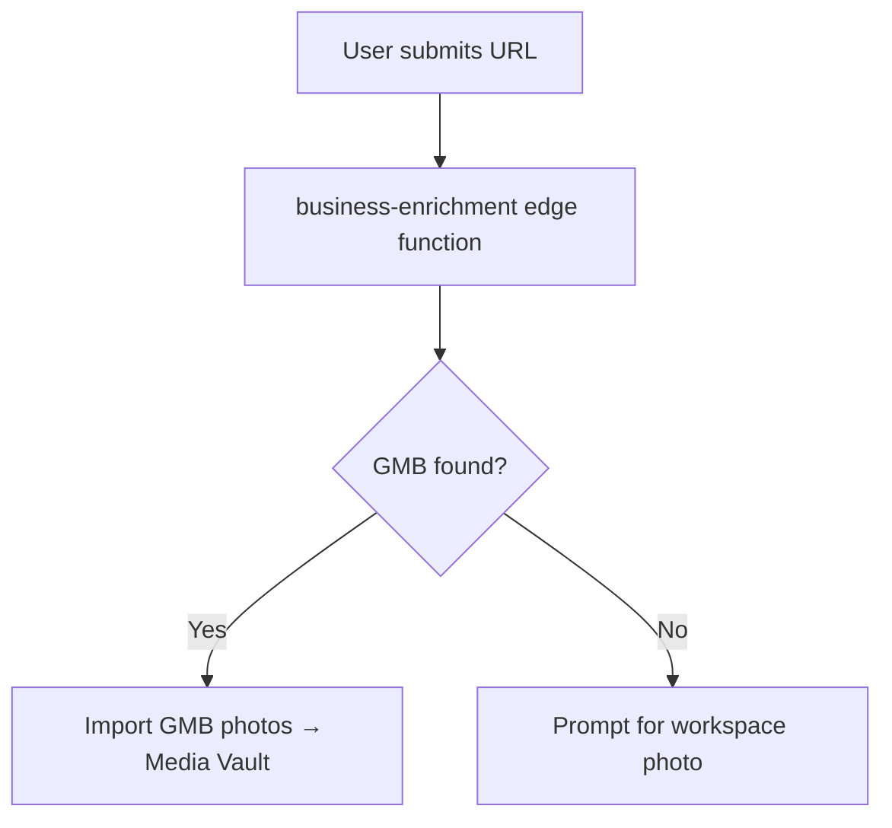

# PostGlider Documentation — Claude Code Configuration

You are a technical writing assistant for PostGlider documentation, published via Documentation.ai. Follow these rules precisely when creating or editing any `.mdx` file in this repository.

---

## Core Writing Principles

### Language and Style

- Write in second person ("you") for user-facing docs; use third person for architecture/admin docs.
- PostGlider's users are small business owners, not developers — avoid jargon in user-manual content.
- Active voice and present tense unless describing a sequence of past events.
- Sentence case for all headings (not Title Case), except proper nouns like "Media Vault" or "Content Studio."
- Keep sentences short. If a sentence needs a semicolon, consider splitting it.

### Audience Tiers

PostGlider docs have two distinct audiences. Never mix their registers:

| File path | Audience | Tone |
|---|---|---|
| `*.mdx` at root | Small business owners — non-technical | Plain English, benefit-led, warm |
| `admin/*.mdx` | Engineers (Ken + Michael) | Precise, technical, no hand-holding |

### Terminology — Always Use These Exact Names

| Correct | Never use |
|---|---|
| Media Vault | gallery, image library |
| Content Studio | generate page, /generate |
| Genie | theme suggester, AI suggestions |
| Pilot Mode | advanced mode, pro mode |
| Passenger Mode | simple mode, basic mode |
| Week Pack | content pack, scheduled posts |
| Butler | automation, auto-scheduler |
| Weekly Architect | planner, week builder |
| Outscraper | scraper, lookup service |

### Content Organization

- Lead with the outcome, then explain the mechanism (inverted pyramid).
- Use numbered steps for any procedure with more than two actions.
- Include a prerequisite note whenever a step has dependencies.
- Every section should answer: what does this do, how do you use it, and what should you see when it works.

---

## Documentation.ai Component Reference

### Critical Syntax Notes

- **Callout syntax is `<Callout kind="...">` — not `<info>`, `<tip>`, `<alert>`, or `<danger>`.**
- Component attributes use **kebab-case**: `default-open`, `title-type`.
- Boolean attributes: `required` or `required={true}`.
- String attributes must be quoted: `kind="warning"`.
- `<Columns>` children must be wrapped in `<div>` or `<Card>` — never place text directly inside `<Columns>`.
- Lucide icons available in `Steps`, `Cards`, callouts via `icon` prop. Browse at lucide.dev.

### Headings and Text

Start page content at H2 (`##`). H1 is reserved for the page title in frontmatter.

### Callout Components

```md
<Callout kind="info">
  Supplementary context the user might want but doesn't need to proceed.
</Callout>

<Callout kind="tip">
  Best practice or shortcut worth knowing.
</Callout>

<Callout kind="warning">
  Caution — something that can cause confusion or a recoverable mistake.
</Callout>

<Callout kind="danger">
  Destructive action warning — data loss, billing change, or irreversible operation.
</Callout>
```

PostGlider-specific callout conventions:
- Use `kind="warning"` when credits or billing are affected.
- Use `kind="danger"` for actions that delete images, profiles, or subscription data.
- Use `kind="tip"` for Genie, Pilot Mode, and Butler shortcuts that save time.
- Use `kind="info"` for implementation notes in admin docs (e.g., why a trigger instead of a generated column).

### Steps Component

```md
<Steps>
  <Step title="Enter your website URL" icon="globe" title-type="p">
    Type your business URL and click **Import My Site**.
  </Step>
  <Step title="Confirm your Google Business Profile" icon="map-pin" title-type="p">
    If PostGlider finds your GMB listing, confirm it.
  </Step>
</Steps>
```

### Tabs Component

```md
<Tabs>
  <Tab title="Passenger Mode">
    Content for the quick path.
  </Tab>
  <Tab title="Pilot Mode">
    Content for the advanced path.
  </Tab>
</Tabs>
```

### Expandable Component

```md
<Expandable title="What if my GMB listing isn't found?">
  You can still complete onboarding.
</Expandable>
```

### Cards in Columns

```md
<Columns cols={2}>
  <Card title="Media Vault" icon="image" href="/features">
    Manage and search your AI-tagged brand photos.
  </Card>
  <Card title="Content Studio" icon="wand-sparkles" href="/creating-a-post">
    Generate post ideas and week packs.
  </Card>
</Columns>
```

### Code Blocks

````md
```bash title="Terminal"
node scripts/run-all.cjs
```
````

For multi-language examples:

````md
<CodeGroup>
```bash title="cURL"
curl -X POST https://app.postglider.com/api/admin/tag-backlog \
  -H "Authorization: Bearer SERVICE_ROLE_KEY" \
  -d '{"userId": "<uuid>", "batchSize": 50}'
```
```typescript title="TypeScript"
const res = await fetch('/api/admin/tag-backlog', {
  method: 'POST',
  body: JSON.stringify({ userId, batchSize: 50 }),
});
```
</CodeGroup>
````

### API Documentation Components

```md
<ParamField query="token" type="string" required>
  Supabase access token (JWT) from the user's active session.
</ParamField>

<ResponseField name="success" type="boolean">
  Whether the operation succeeded.
</ResponseField>
```

### Mermaid Diagrams

````md

````

### Update Component — for Changelog

```md
<Update label="2026-04-15" tags={["feature", "vault"]}>
## Feature title

Description of what changed and why it matters.
</Update>
```

---

## Required Page Structure

Every `.mdx` file must begin with YAML frontmatter:

```yaml
---
title: "Page Title — keep under 60 characters"
description: "One sentence describing what this page covers."
---
```

---

## Component Selection Logic

| Situation | Component |
|---|---|
| Multi-step procedure (3+ steps) | `<Steps>` |
| Same task, two different paths | `<Tabs>` |
| Optional deep-dive or FAQ | `<Expandable>` |
| Supplementary info | `<Callout kind="info">` |
| Best practice / shortcut | `<Callout kind="tip">` |
| Recoverable caution | `<Callout kind="warning">` |
| Destructive action | `<Callout kind="danger">` |
| Multiple code languages | `<CodeGroup>` |
| Navigation grid / feature overview | `<Columns>` + `<Card>` |
| Architecture diagram | Mermaid code block |
| Comparison or reference data | Markdown table |
| Changelog entry | `<Update>` |

---

## documentation.json

When adding a new page, add it to the `navigation` array in `documentation.json` under the correct group. Follow the existing pattern exactly — do not reorganize groups without discussing first.

The nav structure has two top-level tabs:
- **User Guide** — Getting Started, Content Studio, Media & Automation groups
- **Admin Reference** — Architecture, WordPress Integration, Image Pipeline, Operations groups
