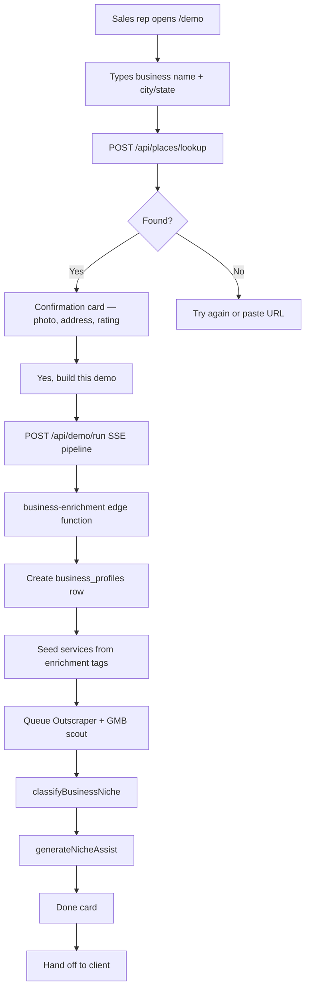

## Overview

The Demo Gun (`/demo`) lets a sales or admin user build a fully-enriched PostGlider profile for any prospect business in under five minutes. It is gated by `is_admin OR is_sales` on the `profiles` table.

## Roles

| Role | Set via | Access |
|---|---|---|
| `is_admin` | Service-role SQL | Full admin + Demo Gun |
| `is_sales` | Service-role SQL | Demo Gun only |

To grant the sales role:

```sql
UPDATE profiles SET is_sales = true WHERE user_id = '<uuid>';
```

`is_sales` is protected by `REVOKE UPDATE (is_sales) ON profiles FROM authenticated` — it can only be set via service role.

## Demo account strategy

Demos are built under internal accounts (`kenlyle+nnn@gmail.com`). The demo account is just a container — the actual assets are the `business_profiles` rows. Multiple demos can accumulate on one account; the handoff step re-parents each profile individually.

## Demo Gun workflow



## `/api/demo/run` SSE pipeline steps

| Step ID | What happens |
|---|---|
| `enrich` | Calls `business-enrichment` edge function with place ID (→ Outscraper GMB pull) or website URL |
| `profile` | Inserts `business_profiles` row with `onboarding_source: 'demo'` |
| `services` | Seeds up to 6 services from `service_promoted` + `business_tags` |
| `classify` | Runs `classifyBusinessNiche(profileId)` → NAICS + SIC codes |
| `intelligence` | Runs `generateNicheAssist(codes, context, key)` → content angles + hooks |
| `gmb` | Inserts `gmb_scout_jobs` row (fire-and-forget; DB webhook triggers scout) |

## Handoff — converting a prospect to a client

The **profile re-parent** pattern: the demo account keeps its auth identity; only the data rows move to the client's account.

**`POST /api/demo/handoff`** — body: `{ profileId, clientEmail }`

1. Checks caller has `is_admin` or `is_sales`
2. Verifies profile exists with `onboarding_source = 'demo'`
3. Looks up client by email in `profiles` table
   - **Existing account** → uses their `user_id` directly
   - **No account** → calls `supabase.auth.admin.inviteUserByEmail(email, { redirectTo: '/generate' })` → creates `auth.users`, sends magic-link invite, seeds a `profiles` row
4. Re-parents the following tables to the new `user_id`:

| Table | Re-parent scope |
|---|---|
| `business_profiles` | `WHERE id = profileId` |
| `week_packs` | `WHERE business_profile_id = profileId` |
| `generated_idea_batches` | `WHERE business_profile_id = profileId` |
| `generated_ideas` | `WHERE business_profile_id = profileId` |
| `user_images` | `WHERE user_id = demoUserId AND created_at` within 1 hour of profile creation |

5. Returns `{ success, invited, message }`

The client receives a Supabase invite email → clicks link → sets password → lands on `/generate` with the full profile, services, and content intelligence already in place.

<Callout kind="warning">
`user_images` uses a time-window heuristic (±1 hour of profile creation) because the table has no `business_profile_id` FK. If a demo account runs two demos in the same hour, images may cross-contaminate. Run demos sequentially or allow a gap between builds.
</Callout>

## Adding a new sales user

1. Have them sign up at `autonomous.postglider.com` normally.
2. Look up their `user_id` in the `profiles` table.
3. Run: `UPDATE profiles SET is_sales = true WHERE user_id = '<uuid>';`

## Demo accounts in use

| Account | Purpose |
|---|---|
| `kenlyle+2@gmail.com` | Primary demo/test account (`is_sales = true`, permanent Goth Tattoo Studio profile) |
