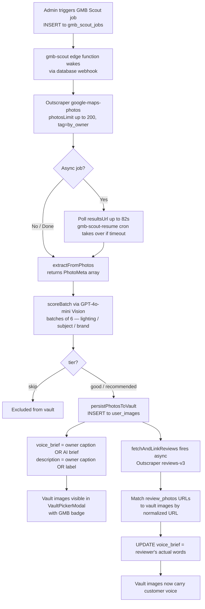

## What GMB Scout Does

When a business profile has a Google Maps URL, an admin can trigger a **GMB Scout** job. The job:

1. Queries the Outscraper `google-maps-photos` endpoint for up to 200 owner photos
2. Scores every photo with GPT-4o Vision (lighting / subject / brand, 1–5 each)
3. Persists recommended and good photos to `user_images` with the origin `gmb`
4. Asynchronously enriches those vault images with real review text from Outscraper `reviews-v3`

The result: vault images arrive pre-loaded with story angles drawn from the business owner's own words and their customers' words — not AI-generated filler.

## Full Data Flow



## voice_brief Priority Hierarchy

Every vault image gets a `voice_brief` — a sentence or two the AI uses as source material when writing a post for that photo. The priority is:

| Priority | Source | Why it wins |
|---|---|---|
| 1st | **Owner-written caption** (`photo_description` from Outscraper photos response) | The business owner described this photo in their own brand voice |
| 2nd | **Customer review text** (from `reviews-v3` when photo URL matches a review) | A real customer's words about this exact experience |
| 3rd | **AI-generated brief** (GPT-4o Vision "story angle" from scoring batch) | Best available guess when no human text exists |

When a user picks a GMB photo from the vault, `PhotoStoryModal` pre-fills the story textarea with whichever level of `voice_brief` was resolved. The user can edit it or add more before generating.

## Vault Image Columns Populated

| Column | Value |
|---|---|
| `origin` | `gmb` |
| `storage_path` | `gmb/external/<uuid>` — synthetic path; image is hosted by Google CDN |
| `public_url` | Full Google photo URL (`photo_url_big` preferred) |
| `description` | Owner caption if present, otherwise Vision AI label |
| `voice_brief` | See priority hierarchy above |
| `tags` | Word-tokenized from description (words > 3 chars, first 8) |
| `quality_score` | Vision total score (max 15) mapped to 1–5 |
| `business_profile_id` | Profile that triggered the scout job |

## Review Photo URL Matching

Google CDN URLs include image-sizing suffixes (`=w1920-h1080`, `=s800`) that vary between the photos API and the reviews API. Before comparing, both sides are normalized:

1. Strip query string (`?...`)
2. Strip Google sizing suffix (`=[whs]<digits>...`)

Only exact-normalized matches link a review to a vault image. No fuzzy matching.

## Scoring Tiers

| Tier | Score (sum of 3 criteria) | Persisted to vault? |
|---|---|---|
| `recommended` | 12–15 | Yes |
| `good` | 8–11 | Yes |
| `skip` | < 8 | No |

If `OPENAI_API_KEY` is not set, all photos default to `good` (score 9) and are persisted without Vision scoring.

## Edge Function Timeout Handling

The photo-fetch step can take 60–90 seconds on large GMB profiles. The function polls for 82 seconds, then hands off to the **`gmb-scout-resume`** pg_cron job (runs every 2 minutes). The Outscraper `resultsUrl` is persisted to `gmb_scout_jobs.outscraper_results_url` immediately after the async job is kicked off, so the resume cron can pick up exactly where the function left off.

## Deploying / Re-deploying

```bash
supabase functions deploy gmb-scout
```

No `--linked` flag — the project is already linked. No JWT verification needed (webhook uses `x-webhook-secret` header instead).

## Triggering a Scout Job (Admin)

```sql
INSERT INTO gmb_scout_jobs (profile_id, user_id, photos_limit, photo_tag)
VALUES ('<profile_uuid>', '<user_uuid>', 100, 'by_owner');
```

The database webhook fires `gmb-scout` automatically on INSERT. Supported `photo_tag` values: `by_owner`, `all`, `latest`.

<Callout kind="info">
  Review enrichment is fire-and-forget. If the Outscraper reviews call times out or returns no photo-bearing reviews, the vault images keep whichever voice_brief was set during the scoring pass. No data is lost.
</Callout>

## Related Files

| File | Role |
|---|---|
| `supabase/functions/gmb-scout/index.ts` | The edge function — scoring, vault persistence, review enrichment |
| `components/generate/VaultPickerModal.tsx` | Shows vault images in Content Studio; passes `voice_brief` to the story modal |
| `components/generate/PhotoStoryModal.tsx` | Pre-fills story textarea from `voice_brief`; user can edit before generating |
| `components/generate/PersonalPhotosSelector.tsx` | Queues photos through story modal before adding to post |
