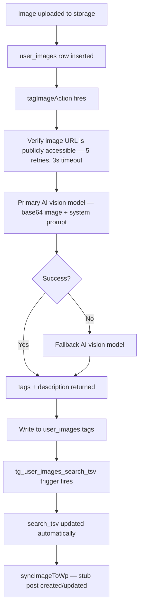

## Tagging Pipeline



## Tag Layers

Every image gets two overlapping layers of tags, merged into a single lowercase `text[]`:

| Layer | Examples |
|---|---|
| **Visual tags** | `outdoor space`, `autumn leaves`, `person smiling`, `red dragon`, `water feature`, `eagle` |
| **Service tags** | `lawn care`, `before/after transformation`, `team culture`, `client spotlight` |

If the user has defined business-specific terms in their profile, the tagger prefers those over generic equivalents.

## Quality Scoring

A separate AI call scores each image on marketing quality (1–10 scale + PASS/REJECT). Stored as:
- `quality_score` (smallint)
- `quality_scanned_at` (timestamp)

Scoring only runs once unless `force=true` is passed. The WordPress gallery search orders results by `quality_score DESC` — best images rank first.

## Batch Tagging

The admin endpoint tags all untagged images for a user in batches:

```bash
POST /api/admin/tag-backlog
Body: { "userId": "<uuid>", "batchSize": 50 }
```

A 300ms delay between images respects API rate limits. This also syncs every tagged image to the WordPress subsite via `syncImageToWp`.

<Callout kind="info">
  The admin panel (`/admin → Bulk tag backlog`) provides a UI wrapper for this endpoint. It's useful for newly onboarded users who have images from the enrichment flow that haven't been tagged yet.
</Callout>

## AI Re-tag (User-initiated)

Users can re-tag any individual image from the image detail dialog in the vault. This re-runs the AI tagging call with a fresh prompt and overwrites the existing tags. Useful when auto-tags missed something obvious or when business terminology has been updated in the profile.
