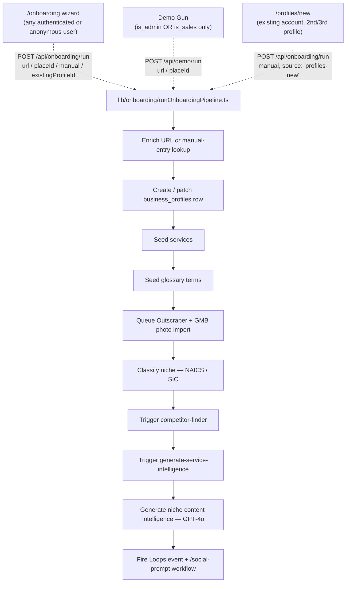

## Admin Panel

The admin panel at `/admin` provides UI wrappers for the most common operations. Access requires a service-role session.

| Panel Section | What it does |
|---|---|
| **Bulk tag backlog** | Runs `tag-backlog` for a given user UUID — tags all untagged images and syncs them to WP |
| **User lookup** | Find a user by email, view profile + credit balance |

---

## Common SQL Operations

Run these in the **SQL editor** (Supabase dashboard → SQL Editor).

**Retag all images for a user:**
```
POST /api/admin/tag-backlog
Body: { "userId": "<uuid>", "batchSize": 50 }
```

**Check gallery token status:**
```sql
SELECT token, created_at, last_used_at
FROM gallery_tokens
WHERE user_id = '<uuid>';
```

**Manually grant pilot_eligible:**
```sql
UPDATE profiles SET pilot_eligible = true WHERE id = '<uuid>';
```

**Check search vector is populated:**
```sql
SELECT id, tags, search_tsv IS NOT NULL AS has_search_vector
FROM user_images
WHERE user_id = '<uuid>'
LIMIT 10;
```

**Check credit balance and billing status:**
```sql
SELECT usage_monthly, tier, billing_status, billing_plan_key,
       profiles_allowed, woocommerce_customer_id
FROM profiles
WHERE user_id = '<uuid>';
```

**Find a user by email:**
```sql
SELECT au.id, au.email, p.tier, p.billing_status, p.profiles_allowed,
       p.woocommerce_customer_id, p.pilot_eligible
FROM auth.users au
JOIN profiles p ON p.user_id = au.id
WHERE au.email = 'user@example.com';
```

**Audit untagged images across all users:**
```sql
SELECT user_id, COUNT(*) AS untagged
FROM user_images
WHERE tags = '{}' OR tags IS NULL
GROUP BY user_id
ORDER BY untagged DESC;
```

---

## Billing & Credit Mechanics

### Credit counters

Three columns on `profiles` track usage:

| Column | What it stores |
|---|---|
| `usage_daily` | Credits consumed today. Reset lazily on the first generation of a new day. |
| `usage_monthly` | Credits consumed this billing cycle. Reset by the subscription webhook on renewal. |
| `extra_posts_remaining` | Purchased add-on credits; never expire; drawn down after `usage_monthly` hits limit. |

### Credit limits

`admin_settings` row with `setting_key = 'plan_limits'` holds a JSONB map of tier → limits:

```json
{
  "pro":         { "daily_credit_limit": 650, "monthly_credit_limit": 750 },
  "enterprise":  { "daily_credit_limit": 30,  "monthly_credit_limit": 75  },
  "free":        { "daily_credit_limit": 5,   "monthly_credit_limit": 5   },
  "first_class": { "daily_credit_limit": 9999,"monthly_credit_limit": 9999 }
}
```

Fetched at runtime by `fetchPlanLimitsForTier()` (`lib/utils/planLimits.ts`). Hardcoded fallbacks exist for the brief window before DB load completes.

### Credit reset

**Daily:** Lazy. `useUsageStats` treats `usage_daily` as 0 when `last_generation_date < today`. The actual DB counter resets inside `charge_credits_atomic` on the first generation of the new day.

**Monthly — authoritative source:** The `wpsubscription-webhook` route (`postglider-auto`'s Cloud Run app, migrated off Supabase Edge Functions 2026-07-31) is the single source of truth. On every `status: active` event from WooCommerce (new subscription OR renewal), it writes `usage_monthly = 0`, `usage_daily = 0`, `usage_reset_date = today`. The billing cycle is defined by WooCommerce's renewal schedule, not the user's signup date. There is no client-side billing cycle calculation — do not add one.

### Credit deduction flow

```
UI → normalizeIntent() → planExecutor()
       └── charge_credits_atomic (Postgres RPC) — atomic, idempotent
             ├── checks usage_monthly < monthly_limit  (402 if over)
             ├── checks usage_daily   < daily_limit    (402 if over)
             ├── increments both counters
             └── logs to credit_usage_log
```

`execute-image` calls `charge_credits_atomic` directly. Legacy paths use `deductGenerationCreditsAction` (server action), which calls the same RPC.

### Subscription status mapping

The `wpsubscription-webhook` route maps WooCommerce statuses to canonical billing states:

| WooCommerce status | Canonical status | Tier effect |
|---|---|---|
| `active` | `active` | Set tier from SKU; reset usage |
| `trialing` | `trialing` | No tier change |
| `on-hold` | `past_due` | No tier change |
| `failed` | `past_due` | No tier change |
| `cancelled` | `canceled` | Downgrade to `free` |
| `expired` | `canceled` | Downgrade to `free` |
| `pending-cancel` | `canceled` | Downgrade to `free` |

### Common billing failure modes

| Symptom | Root cause | Fix |
|---|---|---|
| User shows 0 credits immediately after renewal | Webhook not firing or failing | Check `billing_events` for failed events; verify Bit Integrations → PostGlider webhook is active |
| `usage_reset_date` is months old | Pre-webhook-fix account; webhook never fired | Admin reset via SQL below |
| "Insufficient credits" on first generation of new cycle | Webhook fired but DB write failed | Check `billing_events.processing_status = 'failed'`; retry manually |

**Manual credit reset:**
```sql
UPDATE profiles
SET usage_monthly = 0, usage_daily = 0, usage_reset_date = CURRENT_DATE
WHERE user_id = '<uuid>';
```

### WooCommerce checkout URLs — must target a variation, not the parent product

`admin_settings.woocommerce_urls` (jsonb, keyed by tier) drives the checkout links used by `/pre-checkout` and `/pricing`; `app/pre-checkout/page.tsx` also carries a hardcoded `FALLBACK_CHECKOUT` that must be kept in sync with the `pro` value.

**"PostGlider Pro" (WooCommerce product 59) is a *variable* product** with 10 profile-count variations (482–491, SKUs `PG-PRO-1` through `PG-PRO-10`). A checkout URL that only specifies `add-to-cart=59` leaves WooCommerce with no variation selected and cannot complete a purchase — the URL must include `variation_id` and the variation's own attribute value:

```
https://postglider.com/cart/?add-to-cart=59&variation_id=482&attribute_profiles=1
```

`enterprise` (product 60) is a `simple` product, not variable — `add-to-cart=60` alone is correct for it and needs no `variation_id`.

<Callout kind="warning">
  Found and fixed 2026-08-11: `woocommerce_urls.pro` was `add-to-cart=59` with no variation, silently broken for anyone who actually clicked through it. `extractProductId()` in `app/api/pricing/woo-prices/route.ts` and `app/api/pricing/woo-sync/route.ts` also needed a fix — both now prefer a URL's `variation_id` over `add-to-cart` so live price sync reads the real variation price instead of the parent product's own (non-purchasable) listing. See `research/decisions.md` D-2026-08-11a.
</Callout>

To confirm a product's variations and their IDs/attributes directly against WooCommerce (don't guess IDs from memory):

```bash
curl -s "https://postglider.com/wp-json/wc/v3/products/59/variations?per_page=20" \
  -H "Authorization: Basic $(echo -n "$WOOCOMMERCE_REST_KEY:$WOOCOMMERCE_REST_SECRET" | base64)"
```

### Test accounts

Test accounts (`kenlyle+2@gmail.com`) are not WooCommerce subscribers and never receive renewal webhooks. Reset manually with the query above using UUID `96afe716-532e-4538-8422-abbaf90a5d88`.

### Cross-domain session bridge (SupaWP) — why postglider.com billing "just works"

A PostGlider user only ever authenticates through the Next.js app (Supabase) — never through WordPress directly. The `supawp-pg` plugin on `postglider.com` bridges that identity in both directions so billing self-service *and* the `/onboarding?mode=trial` account-claim flow work without a second login screen. Full endpoint reference and handler logic: [Billing Bridge (supawp-pg)](/admin/billing-bridge).

**The one setting that controls both directions:** `supawp_options.supawp_app_callback_url` (WP Admin → Settings → SupaWP → "App Callback URL"). It must match the live app domain exactly. If it's stale, the failure mode is silent — the affected redirect lands on `postglider.com`'s homepage instead of erroring, with nothing in the app's own logs to point at a WordPress-side config.

<Callout kind="warning">
  Confirmed live 2026-07-14 (D-2026-07-14l): this option still held the retired `https://app.postglider.com/auth/callback` after the domain split — silently stranding every trial-signup account claim on `postglider.com`'s homepage instead of bouncing back to `autonomous.postglider.com`. Fixed via WP-CLI. This was the **second** occurrence of "a config surface still points at the retired `app.postglider.com`" after the 2026-07-03 Supabase Auth redirect-allowlist incident — those are two entirely separate systems (Supabase project settings vs. this WordPress plugin option), so fixing one does not fix the other. If any cross-domain redirect starts landing on the wrong site, check this option first.
</Callout>

**Checking/fixing the live value:** requires SSH + WP-CLI access to the `postglider.com` hosting
account (Hostinger). Connection details and the exact `wp option` commands are in
`research/decisions.md` D-2026-07-14l — not reproduced here since this doc is broader-audience
than that operational log.

---

## Generated Ideas — Stage Lifecycle

Every row in `generated_ideas` carries a `stage` column that drives what the user sees
and what the autonomous agents can touch.

### Stage definitions

| Stage | Meaning |
|---|---|
| `discover` | Freshly generated — in the user's active TinderReview batch awaiting a decision |
| `backlog` | Deferred for later — scored by Butler, eligible for the backlog mini-tinder chip |
| `approved` | User has committed to this idea — appears in the "N ideas ready to review" chip and can be batched |
| `rejected` | Permanently dismissed — never surfaces again in any UI or agent flow |

### How ideas reach `backlog`

1. **Autonomous agent** — the weekly Cloud Run batch (`insertGeneratedIdeas`) inserts content
   directly at `stage: 'backlog'`. This is the primary source. Butler then scores and ranks
   these ideas so the best ones surface first.
2. **Bank It button** — in a fresh-batch TinderReview the user clicks Bank It to defer an idea
   they like but don't want this week. Sets `stage: 'backlog'` immediately.

### How ideas reach `approved`

1. **Approve in TinderReview** (fresh batch) — user taps Approve. In Passenger Mode this also
   auto-schedules the post immediately via RobinReach.
2. **Save** in the single-idea result view — user saves a single generated post.
3. **Add to Batch** in the backlog mini-tinder — user pulls a backlog/approved idea into their
   next content batch (sets `stage: 'approved'` immediately so the slot survives a page refresh).
4. **History select** — user picks a past idea from the history panel in the Content Studio,
   which marks it approved and loads it into the result view.

### Three-strikes pruning

Butler and the backlog mini-tinder both use `record_three_strikes()` to prune weak ideas.
The counter is `butler_skip_count` on `generated_ideas`.

| Action | Strike recorded? | Stage effect |
|---|---|---|
| Butler suggests an idea and user skips it | ✅ +1 | At 3: auto-`rejected` |
| User clicks Skip in the backlog mini-tinder | ✅ +1 | At 3: auto-`rejected`; below 3: stage unchanged |
| User clicks Add to Batch | ✗ | Sets `approved` |
| Image generation fails, credits refunded | ✅ +1 to `image_gen_fail_count` | At 3: auto-`rejected` |

Two separate counters, same threshold (3), same function:

```sql
-- Manual strike (e.g. to test pruning)
SELECT record_three_strikes(
    'generated_ideas',
    '<idea_uuid>',
    'butler_skip_count',  -- or 'image_gen_fail_count'
    3,
    'stage',
    'rejected'
);
```

### The backlog mini-tinder chip

When a user has `approved` or `backlog` ideas for the selected profile, a chip appears
inline on the batch-size row of the Content Studio: **"N ideas ready to review."**

Clicking opens the standard TinderReview with those ideas pre-loaded and relabelled:

| Button | Action |
|---|---|
| **Add to Batch** | Slots the idea (text + image) into the next empty PostBoxList accordion. Sets `stage: 'approved'` in DB. No credits charged. |
| **Skip** | Records one strike (`butler_skip_count + 1`). At 3 strikes the idea is auto-rejected. Stage is NOT immediately changed to `rejected` — the idea stays in the pool until it hits the threshold. |
| **Edit Caption** | Standard inline caption edit before adding. |
| Bank It | **Not shown** — every pass in the backlog pool counts as a strike, so soft-deferring without penalty is intentional removed. |

**Admin reset snippet** — restore ideas after test runs:
```sql
UPDATE generated_ideas
SET stage = 'backlog', butler_skip_count = 0
WHERE id IN ('<uuid1>', '<uuid2>');
```

---

## Deployments

**Deploy edge function:**
```bash
cd ~/projects/postglider2
supabase functions deploy gallery-search
```

---

## Kilo Code Tooling

### kilo+ Usage Examples

Bare start — opens kilo in project mode, counter untouched
```bash
kilo+
```

Named feature — counter scoped to "auth-refactor"
```bash
kilo+ --feature auth-refactor
```

Named feature + kilo args
```bash
kilo+ --feature auth-refactor --model kilo/anthropic/claude-opus-4
```

Reset a feature counter manually
```bash
echo 0 > ~/.cache/kilo_plus/$(echo -n "/path/to/repo:auth-refactor" | md5sum | awk '{print $1}').count
```

**Push migrations:**
```bash
cd ~/projects/postglider2
supabase db push
```

**Deploy Next.js app:** Push to `main` — the hosting platform deploys automatically on every push to `main`.

---

## Image Generation — Provider Health & Circuit Breaker

### Provider overview

PostGlider routes image generation across multiple providers, chosen per use case (brand
knowledge, identity compositing, text rendering, cost). **This page deliberately does not
maintain a hardcoded provider/route/model table** — a prior version did, and it went stale
within weeks (still listed a retired `UPGRADE` route, still called a completed provider
migration "pending," still named the wrong Gemini tier for a route that had moved on).
A table like that can never stay current by hand; the routing logic changes faster than anyone
remembers to update a doc about it.

**The real source of truth, always:**
- **Routing logic** — `lib/config/imageModels.ts` (mirrored to `supabase/functions/_shared/imageModels.ts`).
  This is the only place route→provider→model decisions are made; read it directly rather than
  trusting a doc's paraphrase of it.
- **Current credit costs** — query `operation_pricing` live (see below), not a table in this doc.
- **What actually ran, for a real image** — query `image_gen_provenance` (per-generation rows:
  provider, model, routing key, cost, status). This is ground truth for what a given route
  *actually* used, which can differ from what the routing file currently says if a change
  hasn't been picked up by every caller yet.
- **Market-price drift** — the `pricing-watcher` cron (`app/api/cron/pricing-watcher/route.ts`,
  daily 07:00 UTC) compares current routing costs against alternatives and raises
  `pricing_alerts` automatically. Check that table for what's stale, don't rely on a
  hand-maintained snapshot here.

### Synchronous vs. async completion — why only Riverflow needs polling/webhooks

Confirmed live 2026-07-20 while root-causing a stuck pack (decisions.md D-2026-07-20e/i/l) — worth
stating explicitly since it explains a whole class of "why is this image generation hanging"
questions:

**Google (Gemini/Imagen) and OpenAI (gpt-image-2) image generation in this codebase is fully
synchronous.** `lib/imagegen/geminiImageClient.ts` and `lib/imagegen/openaiImageClient.ts` both
make a plain `fetch()` call and hold the connection open until the image bytes come back in that
*same* HTTP response — no job ID, no "processing" status, no separate check-later step. OpenAI's
call has a 120s timeout as a safety ceiling; real completions are typically single-digit-to-tens
of seconds. **There is no async state machine for either provider** — the caller just waits and
gets its answer.

**Riverflow (via Replicate) is the only provider here that's actually asynchronous** — submit a
prediction, get back a job id, the real render happens later (~3 minutes measured live, corrected
from an earlier unverified "~5 minutes" estimate — see `lib/imagegen/riverflowImageClient.ts`).
That's *why* `image_gen_provenance`, the poll route (`app/api/image/status/[ideaId]/route.ts`),
and the webhook (`app/api/webhooks/replicate/route.ts` → `lib/imagegen/
riverflowCompletionResolver.ts`) all exist — they're solving a problem that is structurally
specific to Riverflow, not a generic "image generation takes a while" concern. Google and OpenAI
never enter that state, so there's nothing to track, poll, or miss for either of them.

**As of today, neither Google nor OpenAI offers a webhook option for image generation to route
around this even if we wanted to** — checked directly against both vendors' current docs, not
assumed: OpenAI's webhook system (Batch jobs, fine-tuning, background Responses, Deep Research,
Realtime SIP) explicitly does not cover the Images API; Google's Gemini Webhooks API (Beta,
`v1beta/webhooks`) covers batch processing, interactions, and video generation completion, but
not image generation. Both vendors have webhook infrastructure — neither has extended it to image
generation yet. If either ever does, `lib/webhooks/webhookRoute.ts`'s shared ack/log/error shell
(currently used only by the Replicate route) is already shaped to take a second provider without
re-deriving the pattern — but there's nothing to build against for Google/OpenAI today.

### MuAPI relationship — removed entirely (2026-07-31)

**MuAPI is not used anywhere in this app, for anything, as of 2026-07-31.** It was already barred
for image generation since 2026-07-20 (`lib/config/imageModels.ts`'s `IMAGE_ROUTING` table had
zero `MUAPI` entries — every image route is `GOOGLE`, `OPENAI`, or `REPLICATE`), and its one
remaining use — video generation (`VIDEO_ROUTING`, the "Make Reel" feature) — was removed entirely
2026-07-31 (reliability concerns, near-zero real usage, no vendor met the app's quality bar; see
the "Video Generation — REMOVED" section below and `decisions.md` D-2026-07-31k). There is no
`MUAPI_API_KEY` anywhere live (Cloud Run env, Supabase Edge Function secrets, or `.env.local`) and
no code path that calls `api.muapi.ai`.

### Fallback strategy — OpenAI and Google direct, with a Replicate fallback for stability

Neither Google nor OpenAI image generation goes through a circuit-breaker table — both are
synchronous calls (see "Synchronous vs. async completion" above), and `provider_circuit` was
checked live 2026-07-20 and confirmed **not to exist** as a table; the "Circuit breaker — GENERAL
route" section that used to live here (SQL for `provider_circuit`, a 3-failures-opens/10-minutes-
half-open state machine) documented a feature that was apparently planned but never actually
shipped.

What's real and shipped instead, as of 2026-07-20 (decisions.md D-2026-07-20m): **every OpenAI
image call in Node code** (`lib/imagegen/openaiImageClient.ts`'s `generateOpenAiImage()` — the one
shared function every OpenAI caller in this codebase already routes through) falls back to the
*same* `gpt-image-2` model hosted on Replicate if the direct OpenAI call exhausts its transient
retries. Passes our own `OPENAI_API_KEY` through Replicate's `openai_api_key` input field, so the
fallback only costs Replicate's thin infra markup, not a second full OpenAI generation charge —
"worth a few pennies" for real resilience against an OpenAI-specific outage, per Ken. No stateful
circuit — a straightforward try-primary/fall-back-on-failure, same shape as
`riverflowCompletionResolver.ts`'s own scene-fallback. **Never falls back to `gpt-image-1`** — the
same model (`gpt-image-2`), just via a different host.

No equivalent fallback exists yet for Google (Gemini) image calls — not built, not currently
planned; Google's own direct-call reliability hasn't shown the same failure pattern that
motivated this for OpenAI.

### Current routing — query it, don't read a table

No hardcoded routing table lives here (see the note at the top of this section for why). To see
what's actually routing where right now:
- Read `lib/config/imageModels.ts` directly for the routing decision per use case.
- Query `image_gen_provenance` for what a real recent generation actually used.

**Credit costs are live in `operation_pricing`.** Query for current values:

```sql
SELECT operation_name, credit_cost, label 
FROM operation_pricing 
WHERE routing_key IS NULL
ORDER BY operation_name;
```

---

## Video Generation — REMOVED (2026-07-31)

PostGlider previously offered an in-app "Make Reel" video-generation feature, routed entirely
through MuAPI (a third-party aggregator vendor). It was removed entirely — code, DB tables/columns
(`video_gen_provenance`, `generated_ideas.video_*`), the live Cloud Run env var, and the Supabase
Edge Function secret. Reasons: reliability concerns with MuAPI specifically (unreliable webhooks,
undocumented price increases), the feature had near-zero real usage (it was beta/admin-gated,
never exposed to regular customers), and no vendor currently meets the app's quality bar for video
generation. See `decisions.md` D-2026-07-31k. If video generation is revisited later, it needs a
new vendor evaluation (Runware was being benchmarked as of this writing) — this is new work, not a
revival of the MuAPI integration.

---

## Pricing Intelligence — Automated Market Price Watcher

PostGlider runs a daily cron that compares current routing costs against market prices and raises alerts when cheaper quality-equivalent alternatives become available. This closes the loop on a systemic gap: leaderboard prices don't reflect what PostGlider actually pays (provider markup can be 2× market rate), and manual monitoring missed pricing changes for weeks.

### What's built

| Component | Path | Purpose |
|---|---|---|
| **Migration** | `supabase/migrations/20260604001000_provider_pricing.sql` | `provider_pricing` table (daily snapshots) + `pricing_alerts` table (routing suggestions) |
| **Cron endpoint** | `app/api/cron/pricing-watcher/route.ts` | Runs daily at 07:00 UTC. Compares hardcoded reference prices against current routing, writes snapshots + alerts. |
| **Manual script** | `scripts/pricing-watcher.cjs` | Same logic, runs locally. Dry-run by default. `--write` persists to Supabase. |
| **vercel.json** | `vercel.json` | Cron registered at `0 7 * * *` (daily, runs after `refresh-route-pricing` at 06:00) |

### How the watcher works

No live-catalog fetch runs anymore — MuAPI, the one provider with a live pricing API, was removed
entirely 2026-07-31 (see above). All prices are the hardcoded `REFERENCE_PRICES` table, updated by
hand when a provider's official docs change.

1. For each active route, looks up known quality-validated alternatives against the reference table
2. Raises a `pricing_alerts` entry when savings exceed **15%** (below that, migration cost exceeds benefit at current volume)
3. Quality-constrained routes (`FACE_IDENTITY`, `PERSON_FOREGROUND`) are skipped — no tested alternative exists (D008)

### Current alerts the watcher will raise

Don't read this as a static list — a hardcoded example here (GENERAL: MuAPI → Google, "pending
migration") went stale after the migration it described actually shipped, and nobody updated the
doc. Query the live table instead:

```sql
SELECT routing_key, current_provider, current_model, current_cost_usd,
       alt_provider, alt_model, alt_cost_usd, savings_pct, quality_note, created_at
FROM pricing_alerts
WHERE status = 'open'
ORDER BY created_at DESC;
```

An open row here means a real, currently-unactioned savings opportunity the watcher found —
check `lib/config/imageModels.ts` to confirm the route hasn't already been migrated by a change
that predates the watcher dismissing its own alert.

### Pricing context — market price ≠ what PostGlider pays

Leaderboard sites (Artificial Analysis, Magic Hour) report the cheapest API price across all providers. Provider costs drive our credit costs via the pricing-watcher cron.

**Pricing-watcher alerts show when a route has a cheaper alternative.** Query:

```sql
SELECT routing_key, current_provider, current_model, current_cost_usd,
       alt_provider, alt_model, alt_cost_usd, savings_pct, quality_note,
       created_at
FROM pricing_alerts
ORDER BY created_at DESC;
```

**Dismiss an alert (consciously skipping the savings):**
```sql
UPDATE pricing_alerts
SET status = 'dismissed', updated_at = now()
WHERE routing_key = 'GENERAL' AND alt_provider = 'GOOGLE_DIRECT';
```

**Mark actioned (routing was changed):**
```sql
UPDATE pricing_alerts
SET status = 'actioned', updated_at = now()
WHERE routing_key = 'GENERAL';
```

**View price history for a model (trend):**
```sql
SELECT fetched_at::date AS date, provider, model, quality_tier, cost_usd, price_source
FROM provider_pricing
WHERE model = 'nano-banana-2'
ORDER BY fetched_at DESC
LIMIT 30;
```

### Running manually

```bash
# Dry run — report only, no DB writes
node scripts/pricing-watcher.cjs

# Write snapshots + alerts to Supabase
node scripts/pricing-watcher.cjs --write
```

### Keeping the watcher current

The watcher's reference prices are hardcoded in two places that must stay in sync:
- `scripts/pricing-watcher.cjs` — `REFERENCE_PRICES` constant
- `app/api/cron/pricing-watcher/route.ts` — `REFERENCE_PRICES` constant

Update both when:
- A provider announces a price change
- A new route is added to `IMAGE_ROUTING`
- A benchmark closes an open quality constraint (e.g., a tested FACE_IDENTITY alternative)

MuAPI (the only provider with a live pricing-catalog API) was removed entirely 2026-07-31 — the
watcher no longer fetches any live catalog, it compares only against the hardcoded reference table.

### Model Monitor Agent (pg-admin) — quality/Elo drift, separate from pricing

The pricing-watcher above only compares **cost**. It has no signal for whether a currently-routed
model has fallen behind on **quality** — a new model could outrank what we route to without ever
tripping a pricing alert. `pg-admin/scripts/model-monitor-agent.cjs` (built 2026-07-16) covers
that gap: it reads postglider-auto's real routing (`lib/config/imageModels.ts`,
`geminiModels.ts`, fetched live via GitHub's Contents API) and compares it against the public
Artificial Analysis quality/Elo leaderboard, producing a Gemini-synthesized recommendation report
in `public.model_monitor_runs`. Report-only — it never changes routing itself, same as
`pricing_alerts`.

The two agents are complementary, not competing: pricing-watcher owns cost drift, Model Monitor
Agent owns quality drift. Query recent runs:

```sql
SELECT created_at, summary, models_reviewed, recommendations_count, raw_report
FROM model_monitor_runs
ORDER BY created_at DESC
LIMIT 5;
```

Run manually (no cron yet — Cloud Run Job + weekly Scheduler is a planned fast-follow):

```bash
cd pg-admin
node --env-file=.env.local scripts/model-monitor-agent.cjs
```

Requires the `gh` CLI authenticated locally with `repo` scope (used to read postglider-auto's
private repo contents without provisioning a separate GitHub PAT — a deployed Cloud Run Job will
need its own `GH_TOKEN` when that fast-follow lands). Full build/verification writeup:
`research/decisions.md` D-2026-07-16h.

---

## Backend Admin API

Operations requiring the service-role key:

**Delete a test user (used by test scripts):**
```bash
curl -X DELETE \
  ${NEXT_PUBLIC_SUPABASE_URL}/auth/v1/admin/users/<uuid> \
  -H "apikey: SERVICE_ROLE_KEY" \
  -H "Authorization: Bearer SERVICE_ROLE_KEY"
```

**Manually provision a gallery token:**
```
POST /api/admin/provision-token
Body: { "userId": "<uuid>" }
Header: Authorization: Bearer SERVICE_ROLE_KEY
```

---

## Media Vault & Brand Assets — Unified Tagging Agent

One shared vision-tagger (`lib/agents/taggingAgent.ts`, `postglider-auto`) now serves both real
callers instead of each maintaining its own tagging logic. Built 2026-07-07 after an audit found
Media Vault's own tagger silently running with zero vocabulary awareness on 4 of its 6 real call
sites, and Brand Assets photo uploads never getting tagged at all despite `ai_tags` already
existing as a column.

**What it gathers before tagging any image** (`getSharedVocabulary(userId)`) — deduped into one
prompt block so a new tag doesn't reinvent a term that already exists elsewhere:
- `glossary_terms` — this business's onboarding-curated preferred vocabulary
- `business_profiles.niche_prompt_assist.merged_content_angles` — onboarding niche angles
- `brand_assets.label` / `ai_tags` already set for the profile
- this user's own recent `user_images.tags` — keeps Media Vault internally consistent over time

**Model path:** Google Gemini 2.5 Flash primary (`callGemini()`, `lib/gemini.ts`), OpenAI
GPT-4o-mini fallback if `GEMINI_API_KEY` is unset or the Gemini call fails — same
vocabulary-aware prompt either way.

**Callers:**
| Caller | Entry point | Notes |
|---|---|---|
| Media Vault | `tagImageAction()`, `lib/actions/galleryActions.ts` | Server action, resolves `userId` via session if not passed explicitly |
| Brand Assets | `POST /api/tag-brand-asset` | Thin route (session-auth'd) — `BrandAssetsCard.tsx` is a client component and fires this fire-and-forget right after a successful upload |

<Callout kind="info">
Existing `brand_assets` rows uploaded *before* 2026-07-07 still have `ai_tags: []` — this fix
only covers the live upload path going forward. A one-time backfill batch job (iterate rows
where `url IS NOT NULL AND ai_tags = '{}'`, call the agent per row) has not been written yet.
</Callout>

---

## Website Vault Sync — Reference-Only Website Image Import (PoC, 2026-07-10)

A proof of concept for pulling a client's own real photography (portfolio, gallery, work
samples) into the Media Vault directly from their live website — closing the gap where a
business's Vault held only AI-generated and manually-uploaded images, never anything from the
site they already run. Built and live-verified for one real client (Stay True Tattoo); **not
yet wired into onboarding or a recurring cron** — see `TASKS.md` for the productization work.

### What it does

1. Fetches the client's `wp-sitemap.xml`, discovers real content pages (no assumption of a
   single "gallery" page — for Stay True Tattoo, portfolio photos were embedded across 5
   separate artist bio pages)
2. Extracts and dedupes `` URLs, filtering icons/logos/tracking pixels
3. Quality-scores every candidate with the same `scoreImageQualityWithGemini()` the rest of the
   app uses (`lib/gemini.ts`) — no separate/duplicate scoring logic
4. Tags passing candidates with the same `tagImage()` agent (`lib/agents/taggingAgent.ts`) —
   this is how a specific image (e.g. a client's "blue dragon" tattoo) gets identified out of a
   page full of opaque camera-ID filenames
5. Imports a selection into `user_images` as **reference-only rows** — `origin: 'website'`,
   `public_url` pointing at the *original* website URL, `size_bytes: 0`, no Supabase Storage
   copy. Same pattern GMB Scout already uses (`origin: 'gmb'` — see [GMB Scout &
   Story Enrichment](/admin/gmb-scout)) — Vault storage cost stays flat regardless of how many
   external images get indexed
6. Syncs each imported image to the client's WordPress subsite via the existing
   `POST /wp-json/postglider/v1/sync-image` endpoint — the same call `tagImageAction()` already
   makes after every tag — so the image appears in the client's SearchIQ-powered gallery in the
   same pass that makes it usable in PostGlider (Vault picker, generation reference, etc.)

### Reference-only vs. Storage-copied

No bytes are copied into Supabase Storage by default — `user_images.public_url` points straight
at the client's own CDN/host. This keeps Vault storage cost flat no matter how many external
images get indexed. Trade-off: a reference row has no protection if the source URL later moves
or 404s (a gap `gmb-scout`'s `origin: 'gmb'` rows already have today too — not new to this PoC).
A client-initiated "pin to Storage" opt-in (copy the bytes before a site migration, etc.) is
part of the not-yet-built productization.

### Running the PoC script manually

```bash
cd postglider-auto
npx tsx scripts/stay-true-vault-import.mts
```

Currently hardcoded to the Stay True Tattoo profile and its 5 known artist pages — generalizing
this to take a `business_profile_id` and discover a client's own image pages automatically is
the first item of the productization work below.

### Not yet built — planned as an admin cron/monitoring job (see `pg-admin`)

This capability is planned to live in **`pg-admin`**, not `postglider-auto` — like GMB Scout's
health-check counterparts, it's operational tooling that watches something (a client's website)
on a cadence, not customer-facing product code:

- **Capture**: a recurring per-client sitemap re-crawl, diffing discovered image URLs against
  `user_images.public_url` for that profile, importing only new ones
- **Usable in PostGlider**: automatic, since the import step writes directly to `user_images`
- **Featured on SearchIQ**: automatic, since `sync-image` fires in the same pass

See `pg-admin/TASKS.md` for the tracked follow-up and `research/decisions.md` D-2026-07-10a for
the full PoC write-up.

---

## SearchIQ Auto-Install — Every New Client Now Gets a Working Faceted Gallery Automatically

Shipped 2026-07-10 (`decisions.md` D-2026-07-10e/g). Closes a gap that existed since SearchIQ was
first integrated: **onboarding never actually configured SearchIQ for a new client.** Every new
subsite got the bare `[pg_gallery]` shortcode (no facets, no autocomplete, client-side filtering
only) until someone did the full manual setup in `SearchIQ → Settings` by hand — see
[SearchIQ & Media Vault Search](/admin/searchiq) for what that manual process used to require.
That manual process is exactly what's now automated.

### What happens automatically now

`provisionWpSubsite()` (`postglider-auto`, `lib/actions/wpActions.ts`) calls a new endpoint on
the subsite itself right after `configure-site`:

```
POST https://{slug}.mypostglider.website/wp-json/postglider/v1/searchiq-install
Header: X-Gallery-Token: <same token sync-image uses>
Body:   { "searchiq_api_key": "<SEARCHIQ_API_KEY env var>" }
```

In one call, this endpoint (`pg-media-vault` v0.4.5+, `includes/searchiq-install.php`):

1. Stores the SearchIQ API key
2. Sets `_siq_postTypesForSearchSelection` — **the option that actually matters.**
   `pg_configure_searchiq()`'s older `_siq_raw_settings` seed turned out to be a write-only
   pre-fill for the SearchIQ admin UI, not something the plugin's own indexing logic reads.
3. Sets `_siq_image_custom_field` to `pg_gallery_image:_pg_image_url` — the fix for the
   broken-thumbnail bug (see [SearchIQ & Media Vault Search](/admin/searchiq)'s existing
   Callout on this)
4. Registers a brand-new SearchIQ engine (`submit_engine()`) — idempotent, skipped if one
   already exists for this subsite
5. Pushes the settings above to that engine (`_siq_sync_settings()`)
6. Swaps the Gallery page shortcode from `[pg_gallery]` to `[searchiq]`

No wp-admin visit, no manual per-client setup. `SEARCHIQ_API_KEY` lives in `postglider-auto`'s
`.env.local` — a single key shared across the merged AppSumo lifetime accounts; SearchIQ assigns
each subsite its own distinct `engineKey` automatically on registration.

<Callout kind="info">
If a subsite somehow already has SearchIQ configured with no key set (`SEARCHIQ_API_KEY` unset at
provisioning time, or provisioned before this shipped), re-run the install manually:

```bash
curl -X POST "https://{slug}.mypostglider.website/wp-json/postglider/v1/searchiq-install" \
  -H "Content-Type: application/json" \
  -H "X-Gallery-Token: <gallery_tokens.token for this profile>" \
  -d '{"searchiq_api_key": "<the real key>"}'
```

Safe to re-run — every step is idempotent.
</Callout>

<Callout kind="warning">
**If this endpoint ever returns what looks like a raw Cloudflare "502 Bad Gateway" HTML page
instead of JSON, that is not a server crash.** Cloudflare intercepts any `502`/`504` status code
from the origin and replaces the response body with its own branded error page — this endpoint
hit that exact trap once during development (a legitimate application-level error was returned
with status `502`, and Cloudflare silently ate the real message). All error responses from this
endpoint now use `4xx`/`500`, which Cloudflare passes through unmodified. If you ever add a new
error path here or in a similar subsite-facing endpoint, avoid `502`/`504` for anything that
isn't an actual gateway failure.
</Callout>

### Not yet done — Phase 2

Ken's stated architecture: admin/operational processes like this should live in `pg-admin`
(alongside its cron jobs), with `postglider-auto` calling `pg-admin` rather than calling
WordPress directly. That move is deferred until `pg-admin`'s first Cloud Run infra (being built
in a separate, concurrent effort — see `pg-admin/CLAUDE.md` Tenants) lands, so this doesn't ship
a second, inconsistent Cloud Run pattern. The WordPress-side endpoint doesn't change for that
move — only *who calls it* does. See `pg-admin/TASKS.md`.

---

## Business Profile Creation — Shared Onboarding Pipeline

Three separate entry points create a `business_profiles` row: the real onboarding wizard
(`/onboarding`, including its `/free-trial` cold-start variant), **Demo Gun** (sales/admin-only
prospect demos), and `/profiles/new` (additional profiles on an existing account, up to its
plan's cap). All three now call one shared server-side pipeline instead of maintaining separate
copies — this wasn't always true, and the drift between copies was a real problem (see below).

### The shared pipeline



### What each caller keeps to itself

| Caller | Auth | Route | Input it can send | `business_profiles.onboarding_source` |
|---|---|---|---|---|
| `/onboarding` wizard | Any authenticated session, or anonymous (`/free-trial`) via Bearer token | `POST /api/onboarding/run` | `url`, `placeId`, `manual`, or `existingProfileId` | `'onboarding'` (URL/placeId scan) or `'manual'` (cold-start, no website/listing) |
| Demo Gun | `profiles.is_admin = true` OR `profiles.is_sales = true` — gated in `/api/demo/run` itself | `POST /api/demo/run` | `url` or `placeId` only — no `manual`/`existingProfileId` | `'demo'` |
| `/profiles/new` | Any authenticated user, subject to the account's profile cap (`profiles.profiles_allowed`; `is_admin` accounts bypass the cap) | `POST /api/onboarding/run` with `{ manual: {...}, source: 'profiles-new' }` | `manual` only | `'profiles-new'` |

### Why this was consolidated (2026-07-27)

Demo Gun's server route (`/api/demo/run`) had been a hand-copied near-duplicate of the wizard's
`/api/onboarding/run` — same enrich→profile→services→classify→intelligence shape, but it had
silently drifted behind: missing the `competitor-finder` trigger, `generate-service-intelligence`
trigger, glossary seeding, the Loops `profile_created` event, and the `/social-prompt` workflow
trigger — all added to the real pipeline after Demo Gun was originally built. Every prospect demo
was quietly weaker than what a real signup got, and nobody had decided that on purpose.
`/profiles/new` was further behind still: it had no enrichment/classification/intelligence
pipeline at all, just a bare `business_profiles` insert plus a `seedGlossary()` call and a
fire-and-forget ping to `/api/classify-niche`.

All three callers now share `lib/onboarding/runOnboardingPipeline.ts` (server pipeline) and
`lib/onboarding/consumePipelineStream.ts` (client-side SSE consumption, previously copy-pasted
identically into `DemoGun.tsx` and `app/onboarding/page.tsx`). See `decisions.md` D-2026-07-27b
for the full writeup, including three product-policy calls confirmed before shipping: fire the
Loops event + `/social-prompt` trigger for every profile regardless of count (not just the
account's first), give Demo Gun the full pipeline despite the extra per-demo API cost, and show
live pipeline progress on `/profiles/new` instead of an instant redirect — creation there is no
longer instant (real enrichment/lookup + classification + GPT-4o intelligence, not a bare insert).

### Interaction with the purchase-to-production test suite

`tests/e2e-integrated/`'s 5-phase suite (`run-all.ts`) simulates a brand-new PG-PRO-3 purchase
end to end (WooCommerce order → Supabase provisioning → UI verification → content generation →
subscription lifecycle). **Phase 3's Uilicious run (`Billing And Profiles.test.js`) is the one
that exercises `/profiles/new`** — it creates 3 profiles up to the account's cap, then confirms
the 4th attempt is blocked with "Profile limit reached." Since `/profiles/new` now runs the real
pipeline instead of an instant insert, profile creation there takes real seconds instead of
milliseconds — the test's wait after each "Create profile" click was increased from `I.wait(3)`
to `I.wait(45)`, with an added assertion that the redirect to the new profile's own page actually
landed rather than trusting the timer alone. **Phase 4** (`phase4-content-generation.ts`) already
depended on Phase 3 having created a real `business_profiles` row to generate against — that
dependency is unchanged, but the profile it now targets arrives fully classified with content
intelligence already generated, not just a bare row.

---

## Client Onboarding Checklist

<Steps>
  <Step title="Verify WP subsite is provisioned" icon="check">
    PostGlider auto-provisions the WP subsite on the client's first image upload (`provisionWpSubsite()` fires). Check `profiles.wp_subsite_slug` is set.
  </Step>
  <Step title="Confirm gallery token exists" icon="key">
    ```sql
    SELECT token FROM gallery_tokens WHERE user_id = '<uuid>';
    ```
    If missing, run provision-token endpoint or trigger any image tag action — token is upserted on account claim.
  </Step>
  <Step title="Run tag backlog" icon="tag">
    Use admin panel → Bulk tag backlog or POST to `/api/admin/tag-backlog`. This also syncs all images to the WP subsite.
  </Step>
  <Step title="Set up SearchIQ" icon="search">
    Install SearchIQ plugin on the subsite, enter the API key, and trigger an index crawl. See [SearchIQ & Image Sync](/admin/searchiq) for full steps.
  </Step>
</Steps>

---

## Onboarding — Cold-Start Path (No Website, No Google Listing)

Some businesses signing up have neither a website nor a Google Business Profile listing —
common for brand-new trades/local-service businesses. Both onboarding entry points
(`/free-trial` and `/onboarding`) now handle this without forcing the owner to invent a URL.

### The two cold-start entry points (plus a third caller that's always manual)

| Entry point | Who uses it | Cold-start UI |
|---|---|---|
| `/free-trial` | Anonymous, pre-signup demo flow | "Do you have a website?" → No → "Google Business Listing?" → No → manual business/profile questions |
| `/onboarding` | Authenticated users completing setup | `BusinessFinder`'s third link, "I don't have a website or a Google listing" |

`/profiles/new` (additional profiles on an existing account, see [Business Profile Creation —
Shared Onboarding Pipeline](#business-profile-creation-shared-onboarding-pipeline) above) also
always sends `manual` — its form never offers a URL/GBP scan option at all, unlike the two
entries above where manual is a fallback among several choices.

All three converge on the same shared pipeline —
`lib/onboarding/runOnboardingPipeline.ts`, called via `POST /api/onboarding/run` with a `manual`
body field instead of `placeId`/`url` — so a cold-start signup gets the identical profile shape
(GPT-based niche classification, service seeding, glossary seeding, content-intelligence
generation) as a URL-scanned one, just without the enrichment scan step.

### What's built

| Component | Path | Purpose |
|---|---|---|
| **Manual body field** | `lib/onboarding/runOnboardingPipeline.ts` (called from `app/api/onboarding/run/route.ts`) | Accepts `manual: { name, location, industry, service_promoted, target_audience, customer_result, tone, business_differentiation, image_prompt_override }`. Skips business-enrichment entirely, builds the same internal shape a website scan would have produced, and runs through the identical create/patch-profile pipeline every other caller uses. Writes `business_profiles.onboarding_source` to `'manual'` (wizard cold-start) or whatever the caller passes via the route's optional `source` field (`'profiles-new'` for the `/profiles/new` caller). |
| **Third BusinessFinder link** | `components/onboarding/BusinessFinder.tsx` | "I don't have a website or a Google listing" — appears below both the search and URL options (a fallback, not a default) on `/onboarding` for users who never went through `/free-trial`. |
| **Manual entry steps** | `app/onboarding/page.tsx` (`MANUAL_BUSINESS`/`MANUAL_PROFILE` states) | Reuses the same `StepBusiness`/`StepProfileBuilder` components `/free-trial` already uses. Turnstile is skipped here (`/onboarding` already requires an authenticated session, unlike the anonymous public `/free-trial` entry). |
| **Skip-forward fix** | `app/onboarding/page.tsx` init effect | If an existing incomplete profile has `website_url` AND `google_maps_url` both null (i.e. it already went through the cold-start path once, typically via `/free-trial`), the pipeline runs immediately via `existingProfileId` alone — the user is never sent back through `BusinessFinder` to answer the same questions twice. |

### Why the skip-forward fix mattered

`/free-trial` already had a full cold-start flow before this work — the actual gap was narrower
than "no fallback exists." A `/free-trial` user who answered "no website"/"no listing" and
completed manual entry would get redirected to `/onboarding` on account claim, where the init
effect used to always show `BusinessFinder` regardless of what the profile already had — asking
the same two questions a second time. Fixed by checking `website_url`/`google_maps_url` before
deciding whether to show the finder at all.

### Common admin queries

**Find cold-start signups (no website, no Google listing):**
```sql
SELECT id, name, industry, location, onboarding_source, created_at
FROM business_profiles
WHERE website_url IS NULL
  AND google_maps_url IS NULL
ORDER BY created_at DESC
LIMIT 20;
```

**Check that classification still ran for a cold-start profile** (GPT-only fallback — no
Context.dev domain crawl is possible without a `website_url`):
```sql
SELECT id, name, classification_codes, niche_prompt_assist IS NOT NULL AS has_niche_assist
FROM business_profiles
WHERE id = '<uuid>';
```

### Troubleshooting

| Symptom | Cause | Fix |
|---|---|---|
| User re-asked "no website?" after already answering on `/free-trial` | Profile's `website_url`/`google_maps_url` aren't both null (partial enrichment wrote one of them) — the skip-forward check requires both | Check the row directly; if enrichment partially succeeded, the profile isn't a pure cold-start case and the re-ask is expected |
| Cold-start profile has no `classification_codes` | GPT classification step failed (rare — check server logs for the `classify` SSE step's error detail) | Re-run `classifyBusinessNiche(profileId)` manually, or have the user revisit `/onboarding` — `existingProfileId`-only calls are idempotent |
| Cold-start profile has no competitor rows | `competitor-finder` only fires when `classification_codes.length >= 3` — a cold-start profile with thin manual input may not classify to 3+ codes | Check `classification_codes` array length; if under 3, the owner may need to add more service detail via Settings before competitor discovery can run |

---

## Onboarding — Idealized Workspace (Generated Background)

`workspace` is a `brand_assets` `asset_type` and one of the top background priorities for most
Genie content categories (`lib/utils/brandAssetMapping.ts`). A business that never uploads a
real workspace photo used to silently get worse backgrounds on most posts. Onboarding now offers
a free, one-time-per-profile AI-generated background so every profile has at least one workspace
asset by the time it reaches the dashboard.

### What's built

| Component | Path | Purpose |
|---|---|---|
| **Generator** | `lib/imagegen/generateIdealizedWorkspace.ts` | Calls gpt-image-2 (OpenAI direct, same route as the two-step Trade pipeline's Step 1 scene setter) with an empty, industry-specific prompt. Mandates a real floor/ground plane spanning the full frame — this is a direct fix for the identity-composite "no standing surface" failure mode, not just a workspace-specific nicety. |
| **API route** | `app/api/generate-workspace/route.ts` | `POST { profile_id }`. Gated on zero existing `workspace`-type `brand_assets` rows for the profile — regenerating before Accept is free (nothing committed yet), the gate only blocks once a row exists. Accepts either a real user session or a service-role Bearer token (the latter used by `scripts/e2e-generate.cjs` to generate per-profile test fixtures, bypassing the gate entirely since it isn't spending a real user's quota). |
| **Onboarding step** | `components/onboarding/StepWorkspace.tsx` | Accept / Regenerate / Skip UI, wired into `app/onboarding/page.tsx`'s `WORKSPACE` step after REVIEW/EQUIPMENT. Accept inserts the `brand_assets` row client-side; Skip inserts nothing. |
| **Readiness signal** | `components/dashboard/OnboardingReadiness.tsx` | New `workspaceReady` dimension — done when a `workspace`-type `brand_assets` row exists for the profile. |

### Common admin queries

**Find profiles with no workspace asset at all** (candidates that skipped the step or signed up
before this feature shipped):
```sql
SELECT bp.id, bp.name, bp.industry
FROM business_profiles bp
WHERE NOT EXISTS (
  SELECT 1 FROM brand_assets ba
  WHERE ba.business_profile_id = bp.id AND ba.asset_type = 'workspace'
)
ORDER BY bp.created_at DESC
LIMIT 50;
```

**Check whether a profile's workspace asset was generated or uploaded** (generated rows are
stored in the `generated-images` bucket; uploaded ones in `business-images`):
```sql
SELECT id, url, label, created_at
FROM brand_assets
WHERE business_profile_id = '<uuid>' AND asset_type = 'workspace';
-- url containing '/generated-images/' → AI-generated via this feature
-- url containing '/business-images/'  → owner-uploaded
```

### Troubleshooting

| Symptom | Cause | Fix |
|---|---|---|
| `/api/generate-workspace` returns 409 | A `workspace`-type `brand_assets` row already exists for the profile — the one-time free gate is working as designed | If the existing asset is bad, delete it via the profile's Brand Assets card, then retry |
| Generated image looks generic / not industry-specific | `business_profiles.industry` is null or very generic for the profile | The route falls back to `'small business'` when `industry` is unset — backfill the profile's industry field, or have the owner upload their own photo instead |
| Script-generated fixture image not appearing in `scripts/output/` | `SUPABASE_SERVICE_ROLE_KEY` not set, or `TEST_BASE_URL`/`--dev` pointing at a server that isn't running | Confirm the target Next.js server is up and the service key env var matches the deployed value (see the general `.env.local` byte-for-byte comparison rule in `postglider-auto/CLAUDE.md` §Cloud Run deployment rules item 6) |

---

## Admin panel tabs

The `/admin` panel is visible to `is_admin = true` accounts only.

| Tab | Purpose |
|---|---|
| Mission Control | Live system health, recent generation activity, error log |
| Tier Quotas | Adjust monthly credit limits per plan |
| Defaults | System-wide defaults (see below) |
| Loops test | Verify Loops.so API key and fire test events |
| Ninjapipe webhook | Configure Butler week-ready notifications |
| Bulk tag backlog | Trigger AI tagging sweep across all vault images |
| User search | Look up any user account |

## Admin defaults

System-wide defaults are stored in `admin_settings` under the key `app_defaults` as a JSONB object.

| Setting | Key | Default | Effect |
|---|---|---|---|
| Week batch size | `week_batch_size` | `7` | Default batch size on the Create Content page batch selector |

Configurable via `/admin → Defaults tab`. Changes take effect on the next page load for all users.

---

## Engagement by Content P — Post Performance Feedback Loop

PostGlider tracks real-world engagement (likes, comments, reach) on published posts and feeds that
data into Butler and the Autonomous Orchestrator so content recommendations are grounded in actual
audience response rather than AI intuition alone.

### What's built

| Component | Path | Purpose |
|---|---|---|
| **Migration** | `supabase/migrations/20260615002000_post_engagement.sql` | `public.post_engagement` table — one row per `(social_post_id, platform)`, updated daily |
| **Migration** | `supabase/migrations/20260820080000_generated_ideas_social_post_id.sql` | Adds `social_post_id` column to `generated_ideas` so autonomous and Tinder-path posts are tracked |
| **Migration** | `supabase/migrations/20260820100000_social_post_provider_marker.sql` | Adds `social_provider` (`'postforme'` \| `'robinreach'`) so the cron knows which vendor's client to poll a given row against |
| **Cron endpoint** | `app/api/cron/engagement-refresh/route.ts` | Runs daily at 14:00 UTC. Fetches platform URLs from the post's own vendor (PostForMe or RobinReach), pulls engagement metrics via Apify. |
| **Butler** | `lib/agents/butler.ts` | Fetches engagement boosts in parallel with vault images; applies ±15% sort multiplier to pillar scores; injects top-performing pillar into the GPT-4o-mini scoring prompt. |
| **Weekly Architect** | `app/api/weekly-architect/route.ts` + `lib/utils/orchestrator.ts` | Fetches engagement (Scan E), derives `pillarScores`, passes them to `buildArchitectPlan` which uses them to set the slot-per-pillar quota while cadence still governs which days. Returns `engagementHint` to the client. |
| **Autonomous Orchestrator** | `app/api/autonomous/orchestrator/route.ts` | Derives full 3Ps quota from engagement; injects signal block into every agent prompt; stores used quota in `batch_generation_jobs.result.quotaUsed`. |
| **vercel.json** | `vercel.json` | Cron registered at `0 14 * * *` |

### How it works

1. Sources posts from **two places** (union, deduplicated by `social_post_id`):
   - `week_pack_items JOIN week_packs` — posts scheduled via the Pack/Butler flow
   - `generated_ideas WHERE social_post_id IS NOT NULL` — autonomous-generated posts and Tinder/swipe-path posts. The `social_post_id` is written back to `generated_ideas` immediately after `scheduleSocialPost()` succeeds.
2. Skips posts already checked in the last 20 hours.
3. Branches per row on `social_provider` to get the live platform post URL: PostForMe posts call
   `socialPostResults.list({ post_id })`; RobinReach posts call `posts.retrieve()`, whose response
   includes `social_profiles[].remote_post_url` directly (no separate results endpoint needed).
   Either way, the URL is only available once the vendor finishes processing — **not** at
   schedule time. RobinReach has no webhook to push this sooner (unlike PostForMe, which also has
   a webhook — `app/api/postforme/webhook/route.ts` — as defense-in-depth alongside this cron);
   for RobinReach, this cron is the *only* path.
4. Calls the appropriate Apify actor per platform to scrape engagement metrics:
   - Instagram: `apify~instagram-scraper` → `likesCount`, `commentsCount`, `videoViewCount`
   - Facebook: `apify~facebook-posts-scraper` → `likes`, `comments`, `shares`
   - LinkedIn: deferred (limited Apify coverage)
5. Upserts to `post_engagement` — one row per `(social_post_id, platform)`, updated on each daily check.

### Schema

```sql
post_engagement (
  social_post_id   text,       -- internal post ID from whichever vendor scheduled it
  social_provider  text,       -- 'postforme' | 'robinreach'
  user_id             uuid,       -- post owner
  platform            text,       -- 'instagram' | 'facebook' | 'linkedin' | ...
  platform_post_url   text,       -- live URL on the platform
  platform_post_id    text,       -- platform-native post ID
  content_category    text,       -- 'Provide' | 'Promote' | 'Personalize'
  likes               integer,
  comments            integer,
  reach               integer,
  impressions         integer,
  shares              integer,
  saves               integer,
  checked_at          timestamptz -- when this row was last updated
)
```

### Autonomous Orchestrator integration (live as of 2026-06-15)

Before generating any posts, the Orchestrator calls `getEngagementSummary(userId)` and runs
`deriveQuota()` to determine this week's 3Ps split. The quota is no longer hardcoded — it is
derived from real audience data and injected into every agent prompt:

```
ENGAGEMENT SIGNAL (last 30 days, this business):
  Personalize : avg 47 likes · 8 comments · 500 reach (6 posts)
  Provide     : avg 31 likes · 5 comments · 300 reach (7 posts)
  Promote     : avg 12 likes · 2 comments · 150 reach (5 posts)
→ This week's quota: 3 Personalize / 3 Provide / 1 Promote
```

**How the quota is derived:**

- Pillar score = `avg_likes + avg_comments×3 + avg_reach×0.01` (comments weighted 3× for higher intent)
- **Minimum 5 posts** per pillar required before a pillar score is used — below this, engagement averages are too volatile (a single viral post with 4 normal ones swings the whole average). Pillars below threshold get a neutral fallback score of 1.
- Falls back entirely to the default 2/3/2 split when all pillars are below threshold.
- Provide absorbs rounding drift (bounds: 1–5); Promote and Personalize are capped at 3 each.
- **±1 weekly cap**: each pillar can shift at most ±1 from the previous week's quota. Prevents a single viral post from whiplashing the quota. The previous quota is stored in `batch_generation_jobs.result.quotaUsed` and read at the start of each batch run.
- Before averaging, `post_engagement` rows are **deduplicated by `social_post_id`**: a post published to both Instagram and Facebook creates two rows, but only the platform with the higher engagement score counts toward the pillar average.

This closes the feedback loop: Gemini generates content → user publishes → Apify measures
response → Orchestrator reads `post_engagement` → next batch reflects real audience response.

### Butler integration

Butler runs `getEngagementBoosts(userId)` on every call, in parallel with the vault image fetch (no added latency). It returns a per-pillar multiplier in the range 0.85–1.15:

- Fetches `post_engagement` for the last 30 days, deduplicates by `social_post_id`
- Requires ≥5 posts per pillar before computing a boost — below that, all multipliers are 1.0 (no effect)
- Applies the multiplier to the final `butler_score` used for sorting — AI scoring stays authoritative; engagement nudges ordering by at most ±15%
- The top-performing pillar is also injected into the GPT-4o-mini scoring prompt as: *"personalize posts earn the most likes and comments from this business's real followers — weight gap_fill higher for ideas in this category"*

**Practical effect for admins:** For a new account with no engagement data, Butler behaves exactly as before. Once an account accumulates 5+ published posts per pillar (tracked via `social_post_id`), Butler's top-ranked ideas will organically skew toward the pillar the audience actually responds to.

### Weekly Architect integration

The Weekly Architect adds a Scan E (engagement fetch) alongside Scans A–D. The signal flows through two mechanisms:

**Slot quota** — instead of the fixed cadence giving each day a category, `buildEngagementDayCategories()` in `lib/utils/orchestrator.ts` computes how many slots each pillar should get (proportional to engagement scores, min 1 per pillar), then uses `CADENCE_DAY_PRIORITY` to decide *which days* each pillar occupies. The top-scoring pillar gets its cadence-preferred days first; lower-scoring pillars fill remaining days.

Example: if engagement says personalize 3× > promote, and the week has 7 days:
- Personalize gets ~3 slots → Friday, Saturday, Sunday (its cadence-preferred days)
- Provide gets ~3 slots → Monday, Thursday + one overflow day
- Promote gets 1 slot → Tuesday (its top cadence day; Wednesday goes to the next-highest pillar)

**Client hint** — the API response now includes `engagementHint: { highPillar, dataPoints, note }` so the Architect UI can display a contextual tip (e.g. *"Your personalize posts averaged the highest engagement last month — the plan has been weighted accordingly"*). Returns `null` when engagement data is insufficient.

Falls back to the standard cadence assignment when all pillars have fewer than 5 posts.

### Common admin queries

**See engagement data for a user (last 30 days, by pillar):**
```sql
SELECT content_category, platform,
       AVG(likes)::int    AS avg_likes,
       AVG(comments)::int AS avg_comments,
       AVG(reach)::int    AS avg_reach,
       COUNT(*)           AS row_count
FROM post_engagement
WHERE user_id = '<uuid>'
  AND checked_at > now() - interval '30 days'
GROUP BY content_category, platform
ORDER BY content_category, platform;
```

**See what quota the Autonomous system used last week:**
```sql
SELECT batch_start, status,
       result->'quotaUsed'->>'promoteCount'     AS promote,
       result->'quotaUsed'->>'provideCount'     AS provide,
       result->'quotaUsed'->>'personalizeCount' AS personalize,
       result->'quotaUsed'->>'engagementDriven' AS engagement_driven
FROM autonomous.batch_generation_jobs
WHERE user_id = '<uuid>'
  AND status = 'completed'
ORDER BY created_at DESC
LIMIT 5;
```

**Check which generated_ideas posts have been linked to a vendor post (and are therefore trackable):**
```sql
SELECT id, content_category, social_post_id, social_provider, created_at
FROM generated_ideas
WHERE user_id = '<uuid>'
  AND social_post_id IS NOT NULL
ORDER BY created_at DESC
LIMIT 20;
```

**Why is a pillar not influencing the quota?** Check if it has fewer than 5 tracked posts:
```sql
SELECT content_category, COUNT(DISTINCT social_post_id) AS unique_posts
FROM post_engagement
WHERE user_id = '<uuid>'
  AND checked_at > now() - interval '30 days'
  AND content_category IS NOT NULL
GROUP BY content_category;
```
If any pillar shows fewer than 5 unique posts, all three consumers (Orchestrator, Butler, Weekly Architect) fall back gracefully — the Orchestrator uses the default 2/3/2 quota, Butler applies no sort boost, and the Architect uses the standard cadence day assignment. This is expected for new accounts and resolves automatically as posts accumulate.

### Platform coverage

| Platform | Scraper | Status |
|---|---|---|
| Instagram | Apify `apify~instagram-scraper` | ✅ live |
| Facebook | Apify `apify~facebook-posts-scraper` | ✅ live |
| X / Twitter | 30 Days Agent (forked `last30days-skill`, Railway) | 🔧 Railway live — route pending |
| TikTok | 30 Days Agent (forked `last30days-skill`, Railway) | 🔧 Railway live — route pending |
| LinkedIn | Deferred — limited scraper support | ⏸ deferred |

**X and TikTok — 30 Days Agent**

A forked copy of [`mvanhorn/last30days-skill`](https://github.com/mvanhorn/last30days-skill) is
hosted on **Railway** (live 2026-06-16). It writes X/TikTok engagement metrics to the same
`post_engagement` table and schema as Instagram/Facebook, so Butler, Weekly Architect, and the
Autonomous Orchestrator pick up X/TikTok data automatically once the `postglider-auto` route is wired.

**How it works:** The scheduling vendor (PostForMe or RobinReach) issues a `social_post_id` for all platforms including X and TikTok.
After publishing, the `engagement-refresh` cron already stores the live post URL in
`post_engagement.platform_post_url` — it just leaves engagement metrics NULL for X/TikTok (no Apify
actor). The 30 Days Agent reads those NULL rows and fills them in using the Railway service.

Three new env vars will be required on Cloud Run (not Vercel):

| Variable | Purpose |
|---|---|
| `XAI_API_KEY` | X / Twitter access via xAI Grok API |
| `SCRAPECREATORS_API_KEY` | TikTok (and Instagram/Threads fallback) |
| `DAYS30_RAILWAY_URL` | Base URL of the Railway-hosted last30days service |

See `postglider-auto/docs/adr/ADR002-30days-agent-x-tiktok.md` for the decision record.

### Dependencies

| Env var | Where | Purpose |
|---|---|---|
| `APIFY_API_KEY` | Cloud Run (production) | Apify scraping — cron degrades gracefully without it (stores platform URL only) |
| `POSTFORME_API_KEY` | Cloud Run (production) | PostForMe client — reads `socialPostResults`, still live for existing PostForMe-scheduled posts |
| `ROBINREACH_API_KEY` | Cloud Run (production) | RobinReach client — the active vendor for new scheduling as of 2026-08-21 |

### Dry run

```
GET /api/cron/engagement-refresh?dry=true
Authorization: Bearer <CRON_SECRET>
```

Returns `{ checked, inserted, dry: true }` without writing to `post_engagement`.

---

## Publish Time Optimizer — Metro-Area (CBSA) Geo Tagging (2026-08-10)

Geography layer groundwork for the Publish Time Optimizer (`lib/optimizer/publishTimeOptimizer.ts`),
which already blends industry priors → niche/competitor signals → this business's own engagement →
cross-customer hour deviation into a per-platform best day/hour. The explicit next layer named was
geography — e.g. Saturday beating Thursday for NYC tattoo shops specifically, vs. Thursday beating
Friday for tattoo shops generally.

- **`business_profiles.metro_cbsa_code` / `.metro_area`** — every business is tagged with its real
  US Census Bureau CBSA (Core-Based Statistical Area) code and display name, resolved via a
  two-step live lookup: Google Places Text Search (`GOOGLE_PLACES_API_KEY`) resolves the profile's
  free-text `location` field to lat/lng, then the Census Bureau's own geocoder resolves that point
  to the official CBSA — no hand-maintained zip/city crosswalk table. New
  `lib/utils/censusGeocoder.ts::resolveMetroArea()`, wired into `lib/onboarding/runOnboardingPipeline.ts`
  as a best-effort, non-blocking step after profile create/patch. `scripts/backfill-metro-areas.cjs`
  caught up the pre-existing profiles (`tagged=199 no_metro=24 failed=0` on the live 2026-08-10 run).
- **`competitor_signals.metro_cbsa_code`** — a new nullable compound-key column alongside `niche_id`.
  `NULL` stays the niche-general fallback row (today's only rows); a metro-specific row is additive,
  never a replacement. `lib/actions/optimizePackSchedule.ts`'s competitor-signals lookup now prefers
  an exact metro match over the niche-general row when one exists, falling back to the old behavior
  otherwise.

See `decisions.md` D-2026-08-10f for the full verification trail (why address-match geocoding
wasn't viable given this app's data shape, and why Census CBSA was chosen over AI-inferred metro
names).

### Real-customer niche+metro cohort day-of-week signal (same day, D-2026-08-10g)

The day-of-week layer above never had a real cross-customer signal — only the sparsely-populated
Predis-sourced `competitor_signals` table. Rather than wait on that external pipeline, a new
materialized view derives the same kind of signal directly from PostGlider's own customers:

- **`mv_niche_metro_day_deviation`** — `post_engagement` grouped by `(niche_id, metro_cbsa_code,
  platform, published_day_of_week)`, mirroring the existing `mv_platform_hour_deviation` pattern
  but scoped instead of global. Carries both `sample_count` (raw rows) and `business_count`
  (`COUNT DISTINCT business_profile_id`) — the real trust gate is distinct businesses, not post
  volume, so one business posting 500 times can never look like cohort consensus.
- **`post_engagement.business_profile_id`** — a prerequisite fix: this table previously only
  carried `user_id`, ambiguous for a multi-profile user. Resolved via `generated_ideas`/
  `week_packs`, written going forward by `app/api/cron/engagement-refresh/route.ts`.
- **`lib/actions/optimizePackSchedule.ts`** sources the day-layer signal from this cohort first
  (gated on `business_count >= MIN_COHORT_BUSINESSES`, currently `3` — a starting heuristic),
  falling back to the Predis-sourced `competitor_signals` table when no cohort clears the gate.
- **`competitors.metro_cbsa_code`** was also added for symmetry (`scripts/backfill-competitor-metro-areas.cjs`:
  `tagged=76 no_metro=44 failed=0`).

The view is expected to be empty/sparse until real customer volume accumulates within a given
(niche, metro) pair — this is data sparsity, not a bug; it self-populates as the customer base
grows. See `decisions.md` D-2026-08-10g.

---

## Local Partners — Real, Geo-Scoped, Owner-Approved Local-Business Referrals (2026-08-20)

Lets a business owner name real local partner businesses (a trusted dry cleaner, a food-delivery
service, a grocery-delivery service) that the autonomous content agents can occasionally credit in
posts — instead of the agent inventing a plausible-sounding local business name, which was the
live gap before this shipped (Promote/Provide/Personalize's prompts had an unguarded "local
partnership" content angle with no real data behind it).

**The core safety design**: Google Places can confirm a candidate business exists and sits in the
owner's own metro area — it can never confirm a real partnership exists. So a suggested candidate
is never usable in generated content until the owner explicitly approves it in Settings. Three
states: `pending` (AI-suggested, Places-verified only), `approved` (owner-confirmed, reaches
caption generation), `rejected` (dismissed, kept so it isn't re-suggested).

### What's built

| Component | Path | Purpose |
|---|---|---|
| **Migration** | `supabase/migrations/20260820040000_local_partners.sql` | New `local_partners` table, RLS mirroring `competitors`' policy pattern |
| **Discovery** | `lib/integrations/localPartnerFinder.ts` | Google Places Text Search by category (dry cleaner, food/grocery delivery), geo-filtered to the owner's own `metro_cbsa_code` — the same CBSA-tagging mechanism the Publish Time Optimizer section above uses. On-demand only, never auto-triggered during onboarding. |
| **API** | `app/api/local-partners/route.ts`, `app/api/find-local-partners/route.ts` | CRUD + discovery-trigger, same conventions as `/api/competitors`/`/api/find-competitors` |
| **Settings UI** | `components/settings/LocalPartnersCard.tsx` | "Suggest Partners" button → pending candidates with Approve/Reject → Approved Partners list |
| **Guardrail** | `lib/autonomous/utils.ts`'s `noPartnerInventionGuidance()` | Wired into all 4 caption-generating agents (Promote/Provide/Personalize/InfluencerInputs) — holds even when no approved partners exist |
| **Context injection** | `lib/autonomous/db.ts`'s `getApprovedLocalPartners()`, wired into the Orchestrator | Only ever reads `status = 'approved'` rows; injected into all 3 pillars' base context alongside the existing team-roster block |

### Geo-scoping limitation (known, disclosed)

CBSA (Census Core-Based Statistical Area) matching is the only geo-scoping mechanism available
without new lat/lng infrastructure — this codebase doesn't store coordinates anywhere. CBSAs can
span a large multi-county area, so "same CBSA" is looser than "same town." The Settings UI copy
says this explicitly: suggested partners are metro-scoped only, not guaranteed genuinely nearby —
the owner should still confirm a real relationship before approving.

---

## GMB Testimonials — Wall of Fame Curation

Business owners can flag specific Google Business Profile reviews as featured testimonials and
tag them to a service, so the Autonomous agents surface the *right* social proof instead of just
the highest-rated review.

### What's built

| Component | Path | Purpose |
|---|---|---|
| **Migration** | `supabase/migrations/20260618140000_autonomous_gmb_testimonials_curation.sql` | Adds `external_review_id`, `is_featured`, `service_id`, `service_tag_source` to `autonomous.gmb_testimonials`; rewrites the upsert RPC to preserve curation on refetch |
| **Prefetch agent** | `app/api/autonomous/prefetch/gmb-testimonials/route.ts` | After banking reviews, calls Google Gemini 2.5 Flash once per batch to classify any untagged reviews against the business's `business_services` list |
| **Settings UI** | `components/settings/TestimonialsCard.tsx` (My Vibe → `/settings`) | Star to feature, dropdown to assign/override service tag, eye toggle to hide a review from agents without deleting it |
| **Server actions** | `lib/actions/testimonialsActions.ts` | `listTestimonialsAction`, `toggleTestimonialFeaturedAction`, `toggleTestimonialActiveAction`, `setTestimonialServiceAction` |

### Operational notes

- The Gemini 2.5 Flash tagging call only fires when there are rows with `service_id IS NULL` —
  it does not re-scan already-tagged reviews, so call volume is bounded to new reviews per batch
  (typically 0–5), not the full review history.
- An owner's manual service tag always wins — once any tag (AI or manual) is set on a row, the
  AI step never overwrites it.
- A review Google returns again on a later fetch (matched by `external_review_id`) keeps its
  `is_featured`/`service_id` — only the rating/comment/author fields refresh.
- The Orchestrator now requests up to 8 banked testimonials per batch (was 3), ordered
  featured-first, each annotated with its service tag in the Promote/Personalize prompt context.

---

## Competitive Intelligence Agent (postglider-auto)

A fifth autonomous agent, self-repairing Predis.ai competitor extraction, runs as its own
Cloud Run service rather than inside `postglider-autonomous` because it needs a real Chromium
binary the main app's image doesn't carry.

### What's built

| Component | Path | Purpose |
|---|---|---|
| **Migration** | `supabase/migrations/20260622200000_autonomous_competitive_intel_predis.sql` | Adds `autonomous.predis_selectors` (selector self-repair memory) and `autonomous.competitor_intel_predis` |
| **Selector verify/repair** | `lib/autonomous/predisSelectors.ts` | `verifySelector()` checks the stored CSS selector against the live DOM on every run, no LLM call; `repairSelector()` only fires on failure, asks Gemini Flash for a replacement, and re-verifies it before ever persisting or trusting it |
| **Extraction** | `lib/autonomous/predisExtraction.ts` | Playwright walk of Predis.ai's Competitor Analysis dashboard, every selector resolved through the verify/repair layer above |
| **Synthesis** | `lib/autonomous/competitiveIntelAnalysis.ts` | Deterministic signal math (format efficiency, day-of-week, theme ROI, hashtag efficiency) ported from `competitor-intel/mfystrategy/code/analyze_competitor.py` |
| **Agent route** | `app/api/autonomous/competitor-intel-agent/route.ts` | Orchestrates extraction → synthesis → Gemini narrative → Supabase write |
| **Cloud Run service** | `Dockerfile.competitor-intel-agent` + `cloudbuild.competitor-intel-agent.yaml` | Deploys as `postglider-competitor-intel-agent`, a sibling service to `postglider-autonomous` |

### Operational notes

- This is the only autonomous agent that requires its own Cloud Run service — it needs
  `PREDIS_EMAIL`/`PREDIS_PASSWORD` and a Chromium binary, neither of which the main app's
  Alpine-based image carries.
- `autonomous.predis_selectors` is seeded with the extractor's best-guess CSS selectors so the
  agent always has a prior to verify or repair against, rather than starting cold.
- An unvalidated selector proposal from Gemini is never persisted or used — `repairSelector()`
  re-runs `verifySelector()` against its own proposal before accepting it.
- As of 2026-06-22, code is written and type-checked but not yet deployed — see `TASKS.md`
  in `postglider-auto` for the remaining rollout steps (migration apply, live dry run, Cloud Run
  deploy, Cloud Scheduler wiring).

### ScrapeCreators-sourced challenger pipeline (2026-06-24)

A second, source-agnostic implementation of the same agent, built to test whether the Predis.ai
dashboard scrape above is even necessary. `computeSignals()`/`computeThemeRoi()` already operate
purely on `RawCompetitorData` and don't care where the post list came from — this pipeline fetches
that same shape directly from ScrapeCreators (`/v1/instagram/profile` + paginated
`/v2/instagram/user/posts`) instead of scraping a UI. **Status: promoted to a real agent +
route — `lib/autonomous/scrapeCreatorsCompetitiveIntelAgent.ts`
(`runScrapeCreatorsCompetitiveIntelAgent()`) and `POST /api/autonomous/scrapecreators-competitor-intel-agent`.**
No Chromium needed, so unlike the Predis agent above this one runs inside the main
`postglider-autonomous` Cloud Run service rather than a dedicated one. Writes to the same
`autonomous.competitor_intel_predis` table as the Predis pipeline, distinguished by a `source`
column (`'predis' | 'scrapecreators'`) — not yet in the Orchestrator's automatic trigger path
(manual/onboarding-triggered call only for now). Full narrative and real measured costs are in
`docs/BUILD-HISTORY.md`'s 2026-06-24 entries.

**Theme/tag generation is not one mechanism — three different tiers, worth knowing before
treating any of it as a stable taxonomy:**

| Axis | Vocabulary source | What Gemini does |
|---|---|---|
| Topic (e.g. "Founder Reflections / Personal Growth Journey") | **None — 100% AI-invented per run.** No fixed category list exists anywhere in the code. | Invents both the grouping and the labels from raw captions, constrained only by structural rules (mutual exclusivity, no catch-all bucket, specific-enough labels, split by framing not just subject) |
| Framing, commercial intent | **Fixed, human-authored** (5 framing values, 2 intent values, hardcoded in `scrapecreators-competitor-intel.mjs`) | Classification only — picks one of the fixed values per post, cannot invent a new one |
| Target persona | **Hybrid** — Gemini proposes 2-4 personas per account (not fixed across accounts), inside human-set guardrails (must include a core-audience default) | Invents the vocabulary for this account, then classifies each post against its own list |

<Callout kind="warning">
Topic clustering is **not deterministic run-to-run.** Re-running the identical prompt against
identical captions on different days produced 6 clusters one run and 4 (with one cluster
absorbing 52% of all posts) the next, before a prompt hardening pass cut that variance down —
even after hardening, repeat runs still varied 6-8 clusters. There is no human review/approval
step before this output reaches a report. Don't build any feature that assumes a theme name is
stable across weeks (e.g. a trend line per theme) without first adding a theme-identity/review
mechanism — none exists today.
</Callout>

**Onboarding integration — not yet built, design only.** This pipeline depends on
`autonomous.competitor_accounts` already having a resolved handle, which today only comes from
the existing bi-weekly `prefetch/discovery` cron (Wednesday 02:00 UTC) — there's no synchronous
path from "client signs up" to "first competitor report" yet. A full run also takes multiple
minutes (4 sequential Gemini calls + ~11 paginated ScrapeCreators fetches in testing), so it
cannot run inline during onboarding regardless — it needs to be a background job with a
ready-notification, the same async pattern other autonomous agents already use. See `TASKS.md`
in `postglider-auto` for the open onboarding-wiring items.

**Real cost per report, measured live via `usageMetadata` and ScrapeCreators' `credits_remaining`
deltas, not estimated:** ~$0.05-0.06 for the base Predis-equivalent report (topic clustering +
narrative), ~$0.10-0.11 if the multi-axis tagging (framing/intent/persona) section is included —
per channel, per report. Cheap enough to give away as the default onboarding deliverable rather
than gating behind a tier, which is the working recommendation, not yet a decision.

---

## Virality Agent (postglider-auto)

Surfaces a real, attributable "this is what's working right now" citation for the Promote/
Provide/Personalize agents — e.g. *"Ayala Bratt of Las Vegas just went viral for a tattoo post
(10x their average engagement), following the broader trend of telling 'behind the ink' tattoo
stories."* Lives inline in the Orchestrator, not a separate Cloud Run service.

### How it works

1. For every tracked competitor (`autonomous.competitor_accounts`, local + national tier), fetch
   their recent posts and flag any post that beats *that account's own* average engagement by
   3x or more — the comparison is always against the account's own baseline, never a global
   threshold, since a 15,000-follower account and a 400-follower account have completely
   different "doing unusually well" lines.
2. Separately, the existing trending-search pass (`generateTrendingHooks()`, Reddit/Pinterest/
   TikTok/Instagram keyword search) runs in parallel.
3. If the outlier post's caption topically overlaps a detected trend, the two get cited
   together. If not, the local outlier is cited alone — the agent never forces an unreal
   connection between the two signals.
4. Gemini writes one sentence from this, under a hard constraint: every named fact (handle,
   location, business type, engagement multiple) must trace back to a field already verified in
   `competitor_accounts` or to the matched trend — never invented. Location is only stated if
   it's in the account record or literally spelled out in the post's own caption/hashtags.
5. The result is injected into the same prompt block all three sub-agents read, framed as
   inspiration ("use as inspiration for an angle, not verbatim") — like the trending-hooks
   block, it doesn't always end up reflected in that week's actual posts.

### Known limitation — content is inferred from caption text only

Many posts (especially Instagram Reels) carry zero descriptive caption text — just hashtags.
Hashtags signal reach intent, not actual content. The agent is instructed to describe the post
generically ("a tattoo post") rather than guess a specific visual theme from hashtags alone, but
that means it currently can't describe a real visual hook it has no text to read off. Two
proposed fixes (single-frame image check via the thumbnail already fetched; full Gemini video
understanding) are written up in `TASKS.md` in `postglider-auto`, not yet built.

### Files

| Component | Path |
|---|---|
| Outlier detection + synthesis | `lib/autonomous/viralityAgent.ts` |
| Standalone verification route | `app/api/autonomous/prefetch/virality/route.ts` |
| Orchestrator wiring | `app/api/autonomous/orchestrator/route.ts` (`generateViralityCitation`, alongside `generateTrendingHooks`) |
| Full origin story | `docs/virality-pipeline-history.md` in `postglider-auto` |

### ViralTrends EXPLAIN-step grounding — `last30days-skill` on Railway (in progress)

ViralTrends (the dedicated sub-agent for the virality-candidate post, `app/api/autonomous/
viraltrends/route.ts`) has two composed jobs: DETECT (find a real outlier post — the Virality
Agent above, live) and EXPLAIN (connect that citation to a genuine macro trend, not an invented
one). EXPLAIN is currently Gemini reasoning from parametric knowledge alone. The plan is to ground
it in a real, cited research pass via [`mvanhorn/last30days-skill`](https://github.com/mvanhorn/last30days-skill)
(forked to `kenlyle2/last30days-skill`), a mature multi-source research engine (Reddit, X,
YouTube, TikTok, HN, Polymarket, Bluesky, web).

<Callout kind="warning">
  The forked repo already has a FastAPI HTTP wrapper (`api.py`, added 2026-06-16) with the right
  shape (`/watchlist/add`, `/watchlist/run`, `/health`), but its Railway service had never
  successfully deployed — 20+ days of "Deploy failed," running a stale batch-script build. Fixed
  the build 2026-07-08 through four layers (missing `pip`, missing `pip` module, PEP 668
  externally-managed environment, `pip install -e .` failing on this repo's flat multi-package
  layout — see `nixpacks.toml`/`railway.json` in the fork for the working config). The build now
  succeeds cleanly, but the container still shows **zero CPU/memory for its entire runtime on
  every deploy** — a Railway account/platform-level restriction not diagnosable from the CLI.
  Check the Railway dashboard for `last30days-skill` for a spending-limit or account warning
  before assuming the code is still broken.
</Callout>

**Git hygiene:** the fork's deploy scaffolding (`api.py`, `airtable_writer.py`,
`naics_topics.json`, `nixpacks.toml`, `railway.json`) is marked `merge=ours` in `.gitattributes`,
so pulling upstream's ongoing research-engine improvements (`git fetch upstream && git merge
upstream/main`) never touches it. Requires `git config merge.ours.driver true` once per local
clone of the fork.

**Not yet built:** once the Railway service is actually running, `lib/autonomous/
viralityAgent.ts` needs to call it with the citation's resolved topic and thread the result into
ViralTrends' EXPLAIN instruction. Full history and reasoning: `docs/Building-Agents.md` §
"Grounding the EXPLAIN step" and `docs/adr/ADR002-30days-agent-x-tiktok.md` in `postglider-auto`.

### Influencer Inputs

Distinct from the Virality Agent above: virality only cites a post that beats an account's own
baseline 3x, so a steady, reliably-high-performing account never wins a citation — it doesn't
spike, it's just consistently good. Influencer Inputs instead surfaces the top-N highest-value
national accounts' most recent post regardless of performance, on the theory that "what are the
biggest names in this niche doing right now" is useful on its own. Same grounded-citation
synthesis rules as Virality (never invent a location/theme the caption doesn't literally
support). `lib/autonomous/influencerAgent.ts`, standalone route
`app/api/autonomous/prefetch/influencer/route.ts`.

### Shared account-post cache (2026-07-20)

National-tier accounts are explicitly "best-in-class niche accounts regardless of location" —
every business in a niche (every tattoo shop, say) independently discovers and tracks the same
handful of famous handles. Before this fix, `getAccountPosts()` hit ScrapeCreators live on every
call with zero caching, so N businesses tracking the same account cost N identical ScrapeCreators
fetches *and* N identical Gemini synthesis calls, every cron cycle — pure duplicated vendor spend
that scales with client count in a niche, not with actual distinct content.

Fixed with `autonomous.account_post_cache`, a table keyed `(platform, handle)` — not per-tenant —
with a 6-hour TTL. `getAccountPosts()` (`lib/autonomous/viralityAgent.ts`, shared by both agents)
checks this cache before ever calling ScrapeCreators. Migration:
`20260720260000_shared_account_post_cache.sql`.

<Callout kind="warning">
This only dedupes the *post-fetch* step. It does **not** stop duplicate *discovery* — each
business profile still independently runs the full Outscraper + ScrapeCreators + Gemini
classification pipeline (`app/api/autonomous/prefetch/discovery/route.ts`) to arrive at tracking
a given handle in the first place. A niche-pool-sharing layer for discovery itself is designed
but deliberately deferred — see `~/.claude/plans/polished-prancing-puzzle.md` in the workspace
root for the full three-layer design (shared discovery pool, `classification_codes`-weighted
secondary-niche blending, and the personalized-accounts cap below). Only the personalized-cap
layer has shipped so far.
</Callout>

### Personalized accounts — up to 5 per business (2026-07-20)

A business can have up to 5 hand-picked influencer/virality accounts that always surface ahead of
the normal `value_score` ranking, regardless of how they were tracked — the answer for a
genuinely idiosyncratic specialty a niche-wide signal can't guess (a tattoo shop's coverup
specialty, a goat-cheese Italian restaurant, a tree-service landscaper).

Implementation: `autonomous.competitor_accounts.is_personalized` (boolean, default false), capped
at 5 per `business_profile_id` by a DB trigger (`enforce_max_personalized_accounts`). RPCs
`autonomous_set_personalized_account()` / `autonomous_unset_personalized_account()`, wrapped by
`setPersonalizedAccount()`/`unsetPersonalizedAccount()` in `lib/autonomous/db.ts`.
`autonomous_get_competitor_accounts()` sorts `is_personalized DESC` first, so personalized picks
are never pushed out by the `LIMIT`. Migration:
`20260720270000_personalized_competitor_accounts.sql`.

Neither `viralityAgent.ts` nor `influencerAgent.ts` needed changes — both already read through
`getCompetitorAccounts()`, so personalized picks flow into candidate generation automatically.

<Callout kind="info">
**UI shipped 2026-07-20** — `components/settings/CompetitorsCard.tsx` (Settings → Competitors).
A competitor row needs an `instagram_handle` (new field, same component) before it can be
flagged with the star icon. Note the two-table wrinkle this UI bridges: `public.competitors` is
the user-facing comparison list (name/reviews/tone/etc.), while the personalized flag actually
lives on `autonomous.competitor_accounts` (agent-only) — `PATCH /api/competitors` with
`{ id, toggle_personalized }` looks up the competitor's handle and calls
`autonomous_set_personalized_account()`/`autonomous_unset_personalized_account()` to mirror the
flag onto the matching (or newly created) `competitor_accounts` row. `GET /api/competitors`
joins `is_personalized` back in per row (service-role read — RLS on `autonomous.competitor_accounts`
is service-role-only) plus a `personalizedCount`/`personalizedLimit` pair for the UI's 5-cap
messaging.
</Callout>

### Known gaps found running a real client's Ultimate Batch (2026-07-20)

Found running Mike Brown's (Stay True Tattoo) real production batch — both real, both still open:

1. **A business must be manually added to `autonomous_get_enabled_profiles()` before Discovery,
   Virality, or Influencer will ever run for it.** Mike's real paying account had zero
   `competitor_accounts` rows because Discovery had never run for him in production — not a bug
   in Discovery itself, just a missing enablement step nobody had done for his account. Worth an
   onboarding-checklist item: confirm a new autonomous client is actually in the enabled-profiles
   set, not just that their profile exists.
2. **Website-mined vault images (`user_images.origin = 'website'`) are stored with the live
   external URL, never re-hosted into Supabase Storage.** The image-generation pipeline's SSRF
   guard (`lib/imagegen/validateImageRefs.ts`) correctly rejects any non-Storage origin as a
   generation input — so the moment content-matching picks a website-mined image as a reference
   (even a mismatch, e.g. a shop logo picked for a tattoo coverup post), generation fails with
   `Image URL is not from an approved storage origin`. Only Instagram-mined images have ever been
   deliberately re-hosted (a one-off for a single team member's photo, `D-2026-07-18g` in
   `research/decisions.md`). This is a systemic gap for every `origin='website'` row across every
   client, not specific to Mike — re-hosting at ingest time (mirroring the pattern already used
   for `websiteIntelligence.ts`'s own storage uploads) is the real fix, not yet built.

---

## TourGuide Agent — AI-Native Guided Tour

TourGuide is the in-app help agent — the floating "?" button (bottom-right, all authenticated
pages). A user types a question in plain English; Gemini Flash returns a personalized
`TourStep[]` sequence, which the client renders as a spotlight-and-tooltip walkthrough over the
real UI. No tour content is hardcoded — every step is generated fresh per call, conditioned on
what the user has actually completed.

In the XPRIZE Mycroft/TourGuide framing (see `docs/spec-mycroft-agent.md` in `postglider-auto`),
TourGuide is "Sherlock" — Mycroft (the synthesis agent) decides *what* a user needs to see;
TourGuide does the interface legwork to show them.

### What's built

| Component | Path | Purpose |
|---|---|---|
| **Route** | `app/api/autonomous/guide/route.ts` | `POST /api/autonomous/guide` — verifies Supabase JWT, builds the prompt, calls Gemini Flash, returns `{ steps: TourStep[] }` |
| **Entry point** | `components/GuideInput.tsx` | Floating help button; wired into `AppShell`, rendered whenever `userId` + `userAttributes` are present (i.e. on every authenticated page) |
| **Renderer** | `components/GuidedTour.tsx` | Resolves each step's `target` against the DOM, draws the spotlight + positioned tooltip, handles next/back/dismiss |
| **Selector registry** | `lib/autonomous/tourSelectors.ts` | Maps logical keys (`nav-create`, `batch-trigger`, etc.) to `[data-tour="..."]` CSS selectors |

### How it works

1. `GuideInput` collects the user's question plus their onboarding signals (`profile_complete`,
   `social_connected`, `vault_has_images`, `first_batch_done`) and current path, and POSTs to the
   guide endpoint with the user's Supabase access token.
2. The route builds one prompt containing: a hardcoded product-capabilities primer
   (`PRODUCT_CONTEXT`), the full `TOUR_SELECTORS` map (so Gemini can only reference real UI
   targets), and the user's current state.
3. Gemini Flash (`AGENT_MODEL`, JSON response mode) returns up to 8 `TourStep` objects. Each step
   has a `target` (selector key or `"center"` for a no-anchor explainer step), `title`, `content`,
   `placement`, and optionally a `navigate`/`click`/`fill` action.
4. `GuidedTour` walks the steps client-side — no further network calls — scrolling each target
   into view and positioning the tooltip relative to it.

### Cross-origin setup

`postglider-auto` is itself the deployed app at `autonomous.postglider.com`, so same-origin calls
need no special config. The route's `ALLOWED_ORIGINS` list (`app/api/autonomous/guide/route.ts`)
currently permits only `https://autonomous.postglider.com` plus localhost — it does **not**
include `app.postglider.com` (retired core app; corrected here 2026-07-14, this doc previously
claimed otherwise). After the planned domain flip (`ARCHITECTURE.md` §1.0 — `app.postglider.com`
reassigned from Vercel to this Cloud Run service), `ALLOWED_ORIGINS` and `NEXT_PUBLIC_AUTONOMOUS_URL`
should be updated together so the two stay in sync; don't add `app.postglider.com` to this list
before that flip actually happens.

### Selector coverage

Every key in `TOUR_SELECTORS` must have a matching `data-tour="<key>"` attribute somewhere in the
DOM, or that step silently renders with no spotlight (still functional, just un-anchored). Current
coverage: `business-name`/`business-location`/`business-industry` (`components/profiles/ProfileForm.tsx`),
`gmb-connect`/`instagram-connect` (`app/(app)/settings/social/page.tsx`), `batch-trigger`/
`batch-results` (`app/(app)/generate/page.tsx`), and all `nav-*` keys (`components/sidebar.tsx`).

<Callout kind="info">
  Don't confuse `data-tour` (TourGuide, this section) with `data-usertour` (the third-party
  UserTour product, tracked separately — see `TASKS.md` "Implement UserTour Tours" in
  `postglider-auto`). They coexist on some of the same elements but are unrelated systems.
</Callout>

### Troubleshooting

| Symptom | Likely cause |
|---|---|
| Button doesn't appear | `userId`/`userAttributes` missing from `AppShell` props — check the calling layout passed them |
| 401 from the guide endpoint | Missing/expired Supabase session token in the request |
| 500, "Agent returned invalid JSON" | Gemini didn't return valid JSON — check `GEMINI_API_KEY` is set and `AGENT_MODEL` hasn't been retired upstream |
| Tour step renders with no spotlight | Step's `target` key has no matching `data-tour` attribute in the DOM — check `lib/autonomous/tourSelectors.ts` against the live page |

---

## Environment Variables Reference

| Variable | Used by |
|---|---|
| `NEXT_PUBLIC_SUPABASE_URL` | All clients |
| `NEXT_PUBLIC_SUPABASE_ANON_KEY` | Browser + anon API calls |
| `SUPABASE_SERVICE_ROLE_KEY` | Server-side admin operations, edge functions |
| `GEMINI_API_KEY` | Image tagging (primary AI vision) |
| `OPENAI_API_KEY` | Image tagging (fallback AI vision), text generation |
| `FAL_KEY` | Image generation (standard quality + background removal) |
| `REPLICATE_API_KEY` | Image generation (person reference) |
| `WP_API_APP_PASSWORD` | `apiguy` application password for subsite provisioning |
| `WP_API_BASE_URL` | `https://mypostglider.website` |
| `APIFY_API_KEY` | `engagement-refresh` cron — Apify actor scraping for post metrics |
| `GOOGLE_PLACES_API_KEY` | Competitor Finder, Local Partners discovery — Google Places Text Search |
| `PEXELS_API_KEY` | Local Expert Agent — real local-scene photo fallback (Wikimedia Commons is primary, no key needed) |
