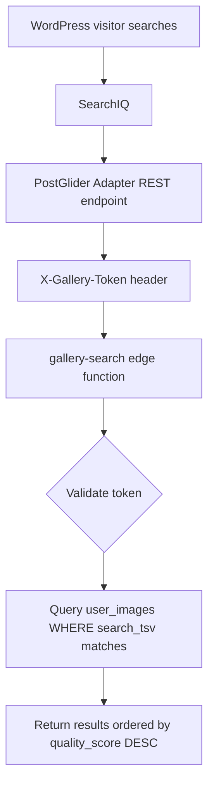

## Architecture



SearchIQ can only index WordPress content — it cannot call external REST APIs directly. The PostGlider Adapter creates thin **stub posts** inside each client's WordPress subsite. SearchIQ indexes these stubs; actual image files never leave PostGlider's storage.

## Stub Post Structure

| Field | Content |
|---|---|
| Title | Tags joined with ` · ` — e.g. `Landscape Lighting · Water Feature · Hardscape` |
| Content | `` + AI description paragraph |
| Excerpt | AI description sentence |
| WP Tags | Each AI tag as a `post_tag` term — powers SearchIQ facets |
| Slug | `pg-img-<image-uuid>` — deterministic, enables idempotent upserts |

## Image Sync Flow

```
tagImageAction() writes tags + description to user_images
  └── syncImageToWp(imageId, publicUrl, tags, description, userId)
        ├── looks up profiles.wp_subsite_slug
        ├── looks up gallery_tokens.token
        └── POST https://<slug>.mypostglider.website/wp-json/postglider/v1/sync-image
              X-Gallery-Token: pg_gallery_<hex>
              → creates or updates pg_gallery_image stub post
```

The call is fire-and-forget. If the subsite isn't provisioned yet, `syncImageToWp` no-ops silently.

## Gallery Token Security

Tokens are `pg_gallery_` + 24 random bytes = 48 hex characters (~192 bits of entropy). They are stored in plaintext in `gallery_tokens` — row-level security (RLS) and service-role-only write access are the security boundary. Clients can revoke instantly if compromised.

| Operation | Who can do it |
|---|---|
| `SELECT` own token | Authenticated user (RLS) |
| `DELETE` own token | Authenticated user (RLS) |
| `INSERT` / `UPDATE` | Service role only (API route + edge function) |

The edge function accepts two auth paths:
- `X-Gallery-Token` header — for the WordPress adapter (long-lived, revocable)
- `Authorization: Bearer <jwt>` — for dev/testing with a real user session

## Search Query Behavior

The edge function uses `textSearch` with `type: 'websearch'`, mapping to Postgres `websearch_to_tsquery`.

| Query | Behavior |
|---|---|
| `red dragon` | Both words must match |
| `"red dragon"` | Exact phrase |
| `dragon OR eagle` | Either word |
| `dragon -eagle` | Dragon but not eagle |
| `large red dragon` | All three words |

Results are ordered by `quality_score DESC` — best images surface first.

## Database Objects

| Object | Migration | Purpose |
|---|---|---|
| `user_images.search_tsv` | `20260415001000` | tsvector column, trigger-maintained over tags + description |
| `gallery_tokens` table | `20260415002000` | One row per user; RLS owner-only select/delete |
| `tg_user_images_search_tsv` trigger | `20260415001000` | Keeps search_tsv updated on insert/update |
| GIN index on `search_tsv` | `20260415001000` | Fast full-text search |

<Callout kind="info">
  The trigger (not `GENERATED ALWAYS`) is intentional. `array_to_string` is `STABLE`, not `IMMUTABLE`, in the current Postgres version — generated columns require `IMMUTABLE` functions.
</Callout>

## Per-Client SearchIQ Setup

<Steps>
  <Step title="Install SearchIQ plugin on the subsite" icon="package">
    Network-activate or per-site install via WordPress admin.
  </Step>
  <Step title="Enter the SearchIQ API key" icon="key">
    SearchIQ → Settings → enter the API key for that domain.

    <Callout kind="info">
      Two AppSumo Startup Package licenses are available: 5,000 documents each, unlimited domains per license. Assign one domain per license; rotate as needed for new client deployments.
    </Callout>
  </Step>
  <Step title="Trigger an index crawl" icon="search">
    SearchIQ → Index → trigger a crawl. Stub posts populate as images are tagged in PostGlider.
  </Step>
</Steps>

## Backfilling Existing Images

For users with existing tagged images, trigger a sync backfill via the admin endpoint:

```bash
curl -X POST https://app.postglider.com/api/admin/tag-backlog \
  -H "Authorization: Bearer SERVICE_ROLE_KEY" \
  -H "Content-Type: application/json" \
  -d '{"userId": "<uuid>", "batchSize": 50}'
```

This re-tags untagged images and syncs all of them to the WordPress subsite.
