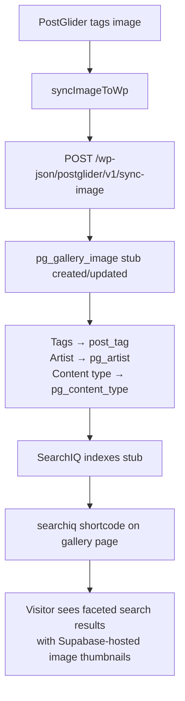

## Why SearchIQ (architecture rationale)

SearchIQ is PostGlider's primary search UI for client gallery pages. This is a deliberate, permanent partnership — not a dependency to be abstracted away.

**What SearchIQ owns that we don't want to rebuild:**
- Autocomplete UI with full visual customization (colors, fonts, layout) via plugin settings — zero code to maintain
- Faceted results page (Date, Category, Tags, Author/Artist) driven by WordPress taxonomies — configured in the admin, not in code
- A free tier of 10,000 documents per domain, with two merged AppSumo lifetime accounts (5,000 documents each) available for premium clients

**Why lock-in is not a concern:**  
All data lives in WordPress CPT posts (`pg_gallery_image`) backed by Supabase Storage. Taxonomies are standard WordPress constructs. If SearchIQ ever disappeared, the stubs, tags, and structured facet data would remain intact and fully portable to any other search tool. There is no proprietary serialization.

**The combination that makes this exceptional:**  
PostGlider's Datamuse thesaurus expansion (cached in `search_expansions` table) plus SearchIQ's synonym group configuration means a visitor searching "botanical" finds images tagged "floral", and vice versa — without any hardcoded synonym lists and without rebuilding a search UI.

---

## Architecture

SearchIQ indexes WordPress CPT posts natively — it does not call external REST APIs. The PostGlider Adapter syncs AI-tagged image metadata into stub posts on each client's WordPress subsite; SearchIQ indexes those stubs. Actual image files never leave Supabase Storage.


```mermaid
flowchart TD
    A[PostGlider tags image] --> B[syncImageToWp]
    B --> C[POST /wp-json/postglider/v1/sync-image]
    C --> D[pg_gallery_image stub created/updated]
    D --> E[Tags → post_tag\nArtist → pg_artist\nContent type → pg_content_type]
    E --> F[SearchIQ indexes stub]
    F --> G[searchiq shortcode on gallery page]
    G --> H[Visitor sees faceted search results\nwith Supabase-hosted image thumbnails]
```

The `gallery-search` edge function and `/wp-json/postglider/v1/search` REST endpoint remain in place for direct API access and testing but are not in the SearchIQ indexing path.

---

## Stub post structure

| Field | Content | SearchIQ role |
|---|---|---|
| Title | Tags joined with ` · ` (first 8, title-cased) | Full-text search + result card heading |
| Content | `` + AI description paragraph | Full-text search body |
| Excerpt | AI description sentence | Result card snippet |
| `post_tag` terms | Each AI tag as a WP tag term | **Tags facet** |
| `pg_artist` terms | Named artist / stylist | **Artist facet** (Author equivalent) |
| `pg_content_type` terms | Content category (see below) | **Category facet** |
| `_pg_image_url` meta | Supabase Storage public URL | Thumbnail in search results — must be declared as SearchIQ's **Image Custom Field** (see setup below) |
| Slug | `pg-img-<image-uuid>` | Idempotent upserts |

Images display in SearchIQ results because SearchIQ is configured to read `_pg_image_url` post meta directly — see the Image Custom Field step in per-client setup below. The Supabase URL is passed through to the search widget unchanged; no image processing occurs on the WordPress server.

<Callout kind="warning">
`_pg_image_url` is written via `wp_insert_post()`'s `meta_input` argument, not a later `update_post_meta()` call — it must already exist in `wp_postmeta` by the time `save_post` fires, because SearchIQ resubmits the document to its cloud index synchronously on that same hook (`siq_save_post` → `siq_insert_post`). A post-hoc meta write is too late for a brand-new post and permanently indexes it with a null image until something re-saves it later (fixed in `pg-media-vault` 0.4.6; see decisions.md D-2026-07-10e for the same symptom hand-fixed once before this was closed at the source).
</Callout>

---

## Facet taxonomy design

### `post_tag` — AI tags

Every AI tag written to `user_images.tags` is synced as a WP `post_tag` term. These are the richest facet: for a tattoo shop they include style descriptors (`neo-traditional`, `blackwork`), subject matter (`dragon`, `rose`, `portrait`), and technique (`fine-line`, `color-realism`).

### `pg_artist` — artist / stylist name

Flat (non-hierarchical) taxonomy. One term per image. Populated from the `artist` field in the sync payload. For a multi-artist tattoo studio, this is the equivalent of SearchIQ's Author facet — visitors filter by their preferred artist.

Sync payload field: `"artist": "Mike Torres"`

Also drives the stub post's `post_author` (via a lightweight, login-less WP user created per artist name — see `pg_resolve_artist_wp_user_id()` in `sync.php`), which is what SearchIQ's result-card byline ("By {author} on {date}") actually reads. Before this existed, every stub's `post_author` defaulted to user ID 0 and the byline rendered as "By  on {date}" with a blank name — the `pg_artist` taxonomy term alone never fed that field.

### `pg_content_type` — content category

Hierarchical taxonomy for the type of image. Pre-defined terms:

| Term slug | Label | Use case |
|---|---|---|
| `portrait` | Portrait | Artist headshots, client close-ups |
| `workspace` | Workspace | Shop interior, station shots |
| `before-after` | Before/After | Healed tattoo comparisons |
| `product-shot` | Product Shot | Merchandise, flash sheets |
| `team-culture` | Team Culture | Staff events, behind the scenes |
| `promotional` | Promotional | Sales, gift cards, announcements |
| `client-spotlight` | Client Spotlight | Client testimonials with photo |

Sync payload field: `"content_type": "before-after"`

Both `artist` and `content_type` are optional in the sync payload. Stubs without them still index and appear in search; they simply have fewer facet options.

---

## Thesaurus expansion → SearchIQ synonyms

PostGlider maintains a `search_expansions` Supabase table: for every search term ever used, Datamuse returns up to 15 semantically related words (score-filtered to > 500). This cache grows automatically as users search.

To feed that data into SearchIQ:

1. Query the cache for high-confidence pairs:

```sql
SELECT term, jsonb_array_elements(expansions::jsonb) AS expansion
FROM search_expansions
WHERE (jsonb_array_elements(expansions::jsonb)->>'score')::int > 700;
```

2. In SearchIQ admin → Synonyms, add bidirectional pairs from that output.

This is a periodic manual step (or can be scripted against the SearchIQ REST API if they expose one). The `search_expansions` table is the source of truth — it is non-proprietary Postgres JSON that works independently of SearchIQ.

**Result:** A visitor searching "botanical" on the gallery page gets results tagged "floral", "cherry blossom", "garden" without any hardcoded synonym list and without custom search code to maintain.

---

## Gallery page: `[pg_gallery]` vs `[searchiq]`

| Shortcode | When to use |
|---|---|
| `[pg_gallery]` | Immediately after subsite provisioning — works without SearchIQ installed. Client-side JS filtering only, no facets. |
| `[searchiq]` | Production gallery page once SearchIQ is installed and the index is built. Full faceted search, autocomplete, visual customization. |

Auto-provisioning (`configure-site`) creates the Gallery page with `[pg_gallery]` so the page works from day one. Once SearchIQ is configured, edit the Gallery page and replace `[pg_gallery]` with `[searchiq]`.

---

## Per-client SearchIQ setup

<Steps>
  <Step title="Install SearchIQ plugin" icon="package">
    Network-activate on `mypostglider.website` so all subsites inherit it, or install per-site. Enter the API key in SearchIQ → Settings.

    <Callout kind="info">
      Two AppSumo lifetime accounts (5,000 documents each, merged into a single pool) are available for premium clients. The free tier covers 10,000 documents per domain — sufficient for most clients indefinitely.
    </Callout>
  </Step>
  <Step title="Configure post types, taxonomies, and image field" icon="settings">
    SearchIQ → Settings → Post Types: enable `pg_gallery_image`.

    SearchIQ → Settings → Facets: enable Tags (`post_tag`), Artist (`pg_artist`), Content Type (`pg_content_type`), Date.

    **Critical — image custom field:** In the post-type settings table, find the `pg_gallery_image` row. In the **"(Optional) Image from custom field"** column, select **`_pg_image_url`** from the dropdown.

    <Callout kind="warning">
      Without this setting, SearchIQ calls WordPress's `wp_get_attachment_url()` to resolve the featured image. Stub posts are not real WordPress media attachments, so that function returns the post's own permalink (an HTML page) instead of the Supabase image URL. SearchIQ's indexer then stores the permalink as the image, fails to render it, and falls back to the placeholder thumbnail. Setting `_pg_image_url` as the custom field bypasses the attachment resolution entirely — SearchIQ reads the Supabase URL directly from post meta.
    </Callout>

    SearchIQ → Appearance: set colors, fonts, and autocomplete layout to match the client's brand.
  </Step>
  <Step title="Run Full Resynchronize Posts" icon="search">
    SearchIQ → Settings → **Full Resynchronize Posts**. Stubs must already be present (run a backfill if needed — see below). This sends all stub post data — including the Supabase image URL from `_pg_image_url` — to SearchIQ's index. Images should appear in search results after the sync completes.
  </Step>
  <Step title="Replace gallery shortcode" icon="edit">
    WordPress admin → Pages → Gallery → edit. Replace `[pg_gallery]` with `[searchiq]`. Publish.
  </Step>
  <Step title="Seed synonyms" icon="book-open">
    Query `search_expansions` (see above) and add high-score pairs to SearchIQ → Synonyms. Repeat quarterly as the cache grows.
  </Step>
</Steps>

<Callout kind="info">
**Automated as of 2026-07-10 (`decisions.md` D-2026-07-10e/g) — the manual steps above are now historical/fallback reference, not the normal path.** `provisionWpSubsite()` calls a new `POST /wp-json/postglider/v1/searchiq-install` endpoint (`pg-media-vault` v0.4.5+) right after `configure-site`, which performs every step above — including the Image Custom Field fix — in one call, with no wp-admin visit. See [Operations → SearchIQ Auto-Install](/admin/operations#searchiq-auto-install-every-new-client-now-gets-a-working-faceted-gallery-automatically) for the full mechanics, the manual re-run command (for a subsite provisioned before this shipped, or with `SEARCHIQ_API_KEY` unset at the time), and a real Cloudflare-502-masking bug found fixing this worth knowing about if you ever touch this endpoint.
</Callout>

---

## Backfilling existing images

### Via tag-backlog (re-tags + syncs)

```bash
curl -X POST https://autonomous.postglider.com/api/admin/tag-backlog \
  -H "Authorization: Bearer SERVICE_ROLE_KEY" \
  -H "Content-Type: application/json" \
  -d '{"userId": "<uuid>", "batchSize": 50}'
```

### Via sync-image directly (already-tagged images)

```bash
curl -X POST "https://<slug>.mypostglider.website/wp-json/postglider/v1/sync-image" \
  -H "Content-Type: application/json" \
  -H "X-Gallery-Token: pg_gallery_<hex>" \
  -d '{
    "image_id": "<uuid>",
    "public_url": "<supabase-storage-url>",
    "tags": ["neo-traditional", "rose", "color-realism"],
    "description": "A vibrant neo-traditional rose tattoo on the forearm.",
    "artist": "Mike Torres",
    "content_type": "portrait"
  }'
```

Useful SQL for backfill prep:

```sql
-- Gallery token for a user
SELECT token FROM gallery_tokens WHERE user_id = '<uuid>';

-- Images to backfill
SELECT id, public_url, description, tags FROM user_images WHERE user_id = '<uuid>';
```

---

## Future: WooCommerce products as gallery posts

WooCommerce products are a natural fit for gallery images that have associated pricing — flash designs, merchandise, booking packages. Products carry Title, Description, Categories, Tags, and Price out of the box. SearchIQ can facet on all of these plus a custom "Artist" product attribute.

This path makes sense when a client wants a searchable, purchasable portfolio — e.g., a tattoo shop selling flash designs or booking deposits online. Implementation notes:

- Products sync alongside `pg_gallery_image` stubs, or replace them for that client
- SearchIQ's Price facet (range slider) becomes available automatically
- No additional taxonomy work needed — WooCommerce categories and tags map directly to SearchIQ facets

This is a separate initiative and should be scoped per client when the pricing use case is confirmed.

---

## Database objects

| Object | Migration | Purpose |
|---|---|---|
| `user_images.search_tsv` | `20260415001000` | tsvector column, trigger-maintained over tags + description |
| `gallery_tokens` table | `20260415002000` | One row per user; RLS owner-only select/delete |
| `search_expansions` table | (galleryActions) | Datamuse thesaurus cache — source of truth for synonyms |
| `tg_user_images_search_tsv` trigger | `20260415001000` | Keeps search_tsv updated on insert/update |
| GIN index on `search_tsv` | `20260415001000` | Fast full-text search |

<Callout kind="info">
  The `search_tsv` trigger (not `GENERATED ALWAYS`) is intentional. `array_to_string` is `STABLE`, not `IMMUTABLE`, in the current Postgres version — generated columns require `IMMUTABLE` functions.
</Callout>

## Gallery token security

Tokens are `pg_gallery_` + 24 random bytes = 48 hex characters (~192 bits of entropy). Stored in plaintext in `gallery_tokens` — RLS and service-role-only write access are the security boundary.

| Operation | Who can do it |
|---|---|
| `SELECT` own token | Authenticated user (RLS) |
| `DELETE` own token | Authenticated user (RLS) |
| `INSERT` / `UPDATE` | Service role only |

The edge function accepts two auth paths:
- `X-Gallery-Token` header — for the WordPress adapter (long-lived, revocable)
- `Authorization: Bearer <jwt>` — for dev/testing with a real user session
