> Audience: product team, QA, engineering, onboarding writers.

```mermaid
flowchart TD
    %% ─── ENTRY ───────────────────────────────────────────────────────────────
    ENTRY([New visitor lands on /start])

    %% ─── ONBOARDING ──────────────────────────────────────────────────────────
    subgraph OB["🚀 /start — Onboarding (no account required)"]
        direction TB
        OB1[Step 1: Enter business website URL]
        OB2[Outscraper enrichment runs in background\nbusiness name · location · services · review themes]
        OB3{GMB listing found?}
        OB4A[Show GMB confirmation card\nUser confirms 'that's me']
        OB4B[User uploads workspace photo]
        OB5A[AI scores GMB photos 1–5\nHigh-quality ones → Media Vault]
        OB6[Step 3: Confirm / refine profile\nservices · audience · differentiator · brand tone]
        OB7[Step 4: Generate first post\nAI caption + image]
        OB7A{Person photo\nprovided?}
        OB7B[Ideogram Remix with person reference\n5 credits]
        OB7C[FAL Ideogram workspace-only\n3 credits]
        OB8[User previews post — Save or Regenerate]
        OB9[Step 5: Create account\nemail + password]
        OB10[Session, profile, and first post preserved]
    end

    %% ─── DASHBOARD ───────────────────────────────────────────────────────────
    DASH([Dashboard — home base])

    %% ─── VAULT ───────────────────────────────────────────────────────────────
    subgraph VAULT["🗂️ Media Vault — /gallery (ongoing, all tiers)"]
        direction TB
        V1[Images arrive via GMB import,\nmanual upload, or generation]
        V2[Gemini Vision auto-tags each image\nvisual tags + service tags]
        V3[AI quality score assigned\nmarketing suitability 1–5]
        V4[Smart search: natural language\ne.g. 'rainy day photos · team shots']
        V5[Bulk purge low-quality images\nfrom Tools page]
    end

    %% ─── GENERATE PAGE ───────────────────────────────────────────────────────
    subgraph GEN["✏️ Content Studio — /generate"]
        direction TB
        GEN1[Select niche / content theme]
        GEN2[Genie AI engine\nreads profile · reviews · balance · weather · day-of-week]
        GEN3[4 tailored post angles suggested]
        GEN4{User accepts suggestion\nor types own theme?}
        GEN5[Theme confirmed → click Generate]
        GEN6[Batch of text ideas generated\nconcept · caption · CTA · timing — 1 credit each]
        GEN7[Tinder-style swipe review\nRight = save · Left = skip · Tap = edit inline]

        subgraph PM["🛫 Passenger Mode — default path"]
            PM1[Saved idea ready for Quick Visual]
            PM2[Ideogram generates single image\n2 credits]
            PM3[Idea card complete — ready for pack]
        end

        subgraph PILOT_GATE["🔒 Pilot Mode gate"]
            PG1{Account age ≥ 7 days\nAND tier = Pro+?}
            PG2[Locked — 'Unlock in N days']
        end

        subgraph PILOT["🎛️ Pilot Mode — Antigravity Drawer"]
            PIL1[User sets preferences:\nshow drafts first · include text · identity strictness · style override]
            PIL2[Orchestrate Plan — GPT-4o agent\nreads post context · profile · vault photos · controls\n2 credits]
            PIL3[Plan summary shown\nprovider · quality · prompt · credit estimate]
            PIL4{User approves plan?}
            PIL5A[Explore stage:\n4 cheap drafts — gpt-image-1 medium\n1 credit each]
            PIL5B[Final stage:\n1–2 premium images\nIdeogram v3 or OpenAI high-quality\n8 credits]
            PIL5C[Identity-locked:\nIdeogram Remix with headshot\n8 credits]
            PIL6[FAL async — webhook delivers image\nbroadcast to activity feed]
            PIL7[User picks favorite final image]
        end
    end

    %% ─── NICHE + DRIP ────────────────────────────────────────────────────────
    subgraph NICHE["🏷️ Niche Classification (background, after enrichment)"]
        direction LR
        NC1[GPT-4o-mini classifies NAICS + SIC codes]
        NC2[User confirms codes in /settings]
        NC3[Unlocks: precise competitor discovery\ndeeper content signals · niche_confirmed email]
    end

    %% ─── BUTLER ──────────────────────────────────────────────────────────────
    subgraph BUTLER["🤵 Butler AI — Pro+ · same drip as Pilot Mode"]
        direction TB
        BUT1[Butler triggered — scans vault + idea backlog]
        BUT2[Matches images to ideas via semantic overlap\nno extra AI call — uses existing tags]
        BUT3[Golden Pairs generated\nconfidence 0.0–1.0 + plain-English reasoning]
        BUT4[Curation Drawer surfaces best pairs]
        BUT5[One tap: approve pair\nidea → 'approved' · slotted into active pack]
        BUT6{≥ 6 pairs for\na full week?}
        BUT7[Week Ready notification\nvia Ninjapipe webhook]
    end

    %% ─── WEEKLY ARCHITECT ────────────────────────────────────────────────────
    subgraph ARCH["🏗️ Weekly Architect — Pro+ · /generate → Architect button"]
        direction TB
        AR1[Scans backlog — skips seasonally irrelevant ideas]
        AR2[Scans vault with freshness scoring\noverused images deprioritized]
        AR3[Checks content balance\nPromote · Provide · Personalize mix]
        AR4[Applies weather signals\nrain/heat prep for sensitive industries]
        AR5[Fills gaps with gap_generate markers]
        AR6[Outputs 7-day WeekSlot plan]
        AR7[User reviews → clicks Assemble Pack]
    end

    %% ─── WEEK PACKS ──────────────────────────────────────────────────────────
    subgraph PACKS["📦 Week Packs — /packs"]
        direction TB
        WP1([Pack created — status: building])
        WP2[Add / reorder slots\ndrag-and-drop]
        WP3[Draft images — gpt-image-1 medium\n1 credit each]
        WP4([Status: ready_for_upgrade])
        WP5[Upgrade to final — full Pilot render\n8 credits per idea]
        WP6([Status: upgrading → ready_to_export])
        WP7[Export to UploadPost\nInstagram · Facebook · TikTok · YouTube · Twitter · LinkedIn]
        WP8([Status: exported])
    end

    %% ─── COMPETITOR INTEL ────────────────────────────────────────────────────
    subgraph COMP["🔍 Competitor Intelligence — /settings (background)"]
        direction LR
        CI1[Competitor Finder edge function\nNAICS/SIC → GMB data · website URLs · Predis.ai signals]
        CI2[Content strategy nudges\nfeed into Genie angles]
    end

    %% ─── EMAIL LIFECYCLE ─────────────────────────────────────────────────────
    subgraph EMAIL["📧 Email Lifecycle — Loops.so (triggered automatically)"]
        direction LR
        EM1[profile_created → welcome sequence]
        EM2[enrichment_complete → profile ready]
        EM3[first_post_generated → activation sequence]
        EM4[first_pack_created → engagement sequence]
        EM5[niche_confirmed → niche expert nurture]
        EM6[subscription_upgraded → advanced tips]
        EM7[subscription_downgraded → win-back]
    end

    %% ─── CREDIT SYSTEM ───────────────────────────────────────────────────────
    subgraph CREDITS["💳 Credits (reset monthly on billing anniversary)"]
        direction LR
        CR1[Free: 50/mo · Pro: varies · Pro+: 600/mo]
        CR2[Atomic deduction — SELECT FOR UPDATE\nprevents TOCTOU races]
        CR3[Admin accounts: unlimited credits\ncapped at 999999 internally]
    end

    %% ─── CONNECTIONS ─────────────────────────────────────────────────────────
    ENTRY --> OB1
    OB1 --> OB2
    OB2 --> OB3
    OB3 -->|Yes| OB4A --> OB5A --> OB6
    OB3 -->|No| OB4B --> OB6
    OB6 --> OB7 --> OB7A
    OB7A -->|Person photo| OB7B --> OB8
    OB7A -->|Workspace only| OB7C --> OB8
    OB8 --> OB9 --> OB10 --> DASH

    DASH --> GEN1
    DASH --> VAULT
    DASH --> PACKS
    DASH -.->|background| NICHE
    DASH -.->|background| COMP

    GEN1 --> GEN2 --> GEN3 --> GEN4
    GEN4 -->|Accepts| GEN5
    GEN4 -->|Types own| GEN5
    GEN5 --> GEN6 --> GEN7

    GEN7 -->|Saved idea| PG1
    PG1 -->|No — Passenger| PM1 --> PM2 --> PM3 --> WP1
    PG1 -->|No — gate| PG2
    PG1 -->|Yes — Pilot| PIL1 --> PIL2 --> PIL3 --> PIL4
    PIL4 -->|Approved| PIL5A & PIL5B & PIL5C
    PIL5A --> PIL6
    PIL5B --> PIL6
    PIL5C --> PIL6
    PIL6 --> PIL7 --> WP1

    WP1 --> WP2 & BUT1 & AR1
    WP2 --> WP3 --> WP4 --> WP5 --> WP6 --> WP7 --> WP8

    BUT1 --> BUT2 --> BUT3 --> BUT4 --> BUT5 --> WP1
    BUT5 --> BUT6
    BUT6 -->|Yes| BUT7

    AR1 --> AR2 --> AR3 --> AR4 --> AR5 --> AR6 --> AR7 --> WP1

    OB5A --> VAULT
    PM3 -.->|image stored| VAULT
    PIL7 -.->|image stored| VAULT
    VAULT -.->|feeds| BUT1
    VAULT -.->|feeds| AR2

    OB2 -.->|triggers| NICHE
    NICHE -.->|feeds| COMP
    COMP -.->|nudges| GEN2

    OB10 -.->|fires| EM1
    OB2 -.->|fires| EM2
    GEN7 -.->|first save fires| EM3
    WP1 -.->|first pack fires| EM4
    NICHE -.->|confirmed fires| EM5

    GEN6 -.->|deducts| CREDITS
    PM2 -.->|deducts| CREDITS
    PIL2 -.->|deducts| CREDITS
    PIL5A -.->|deducts| CREDITS
    PIL5B -.->|deducts| CREDITS
    WP3 -.->|deducts| CREDITS
    WP5 -.->|deducts| CREDITS

    classDef gate fill:#fef9c3,stroke:#ca8a04,color:#1c1917
    classDef locked fill:#fee2e2,stroke:#dc2626,color:#1c1917
    classDef terminal fill:#dcfce7,stroke:#16a34a,color:#1c1917
    classDef system fill:#eff6ff,stroke:#3b82f6,color:#1c1917

    class PG1,OB3,OB7A,PIL4,BUT6 gate
    class PG2 locked
    class WP8,ENTRY terminal
    class CREDITS,EMAIL system
```

## Reading the diagram

**Solid arrows (`→`)** — the primary user journey, in rough chronological order.

**Dotted arrows (`-.->`)** — background or side-effect flows: images landing in the vault, credits being deducted, emails firing, Genie getting fed signals.

**Yellow nodes** — decision gates (account age, tier, plan approval).

**Red node** — hard lock ("Pilot Mode not yet available").

**Green nodes** — terminal states (new visitor, pack exported).

## Key drip gates

| Feature | Minimum tier | Account age |
|---|---|---|
| Pilot Mode (Antigravity Drawer) | Pro+ | ≥ 7 days (`pilot_eligible = true`) |
| Butler AI | Pro+ | Same drip as Pilot Mode |
| Weekly Architect | Pro+ | No age gate |
| Quick Visual (Ideogram) | Free | No gate |
| Genie themes | Free (1 credit) | No gate |
