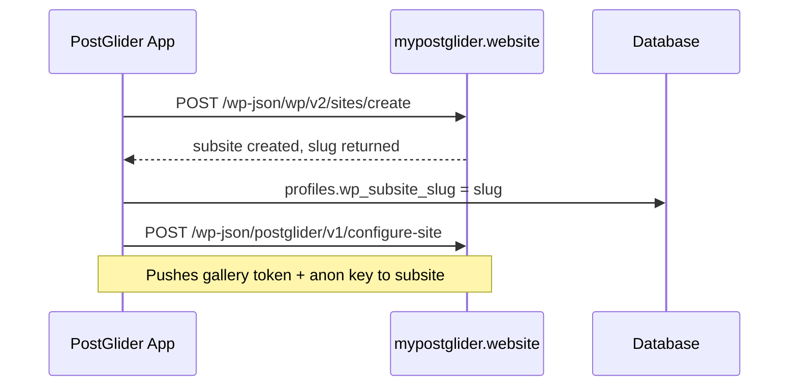

## Overview

| | postglider.com | mypostglider.website |
|---|---|---|
| **Type** | Single site | Multisite |
| **Purpose** | Marketing + billing | SearchIQ / Media Vault per-user subsites |
| **Plugin** | `supawp-pg` (`kenlyle2/supawp-pg`) | `pg-media-vault` (`kenlyle2/pg-media-vault`) |
| **Plugin role** | `supawp/v1/auth/session` session bridge | `postglider/v1/search` per subsite |
| **Subsite creation** | N/A | Auto on first image tag |
| **Credentials set via** | WP Admin → SupaWP Settings | `configure-site` API call |

## postglider.com — Marketing & Billing

Single-site WordPress. The billing platform and subscription manager handle all financial transactions: new subscriptions, upgrades, cancellations, and order history. Users manage billing via the `/my-account` page.

<Callout kind="alert">
  There is no plan to make postglider.com a multisite — ever. All billing stays on this single installation.
</Callout>

The `supawp-pg` plugin is installed here solely to serve the `supawp/v1/auth/session` endpoint that gives PostGlider users a seamless WP session when they click **Manage Subscription** in the app.

WordPress users on postglider.com are created automatically at checkout — every paying subscriber has a WP account.

## mypostglider.website — SearchIQ / Media Vault

WordPress Multisite. Each PostGlider user gets a subsite automatically when their first image is tagged (`provisionWpSubsite()` fires).

The `pg-media-vault` plugin is network-activated here and exposes the `postglider/v1/search` REST endpoint on each subsite. SearchIQ indexes that endpoint to make the user's AI-tagged images semantically searchable inside WordPress.

## Subsite Provisioning Flow

The `apiguy` Application Password (stored as `WP_API_APP_PASSWORD` in `.env.local`) is used for provisioning — super admin credentials.

<Callout kind="info">
  The App Passwords toggle must be ON in the hosting control panel. Enable it at: Hosting control panel → Tools → Application Passwords.
</Callout>

## Key WordPress Credentials

| Credential | Env var | Notes |
|---|---|---|
| `apiguy` Application Password | `WP_API_APP_PASSWORD` | Super admin, used for site provisioning |
| Multisite base URL | `WP_API_BASE_URL` | `https://mypostglider.website` |
