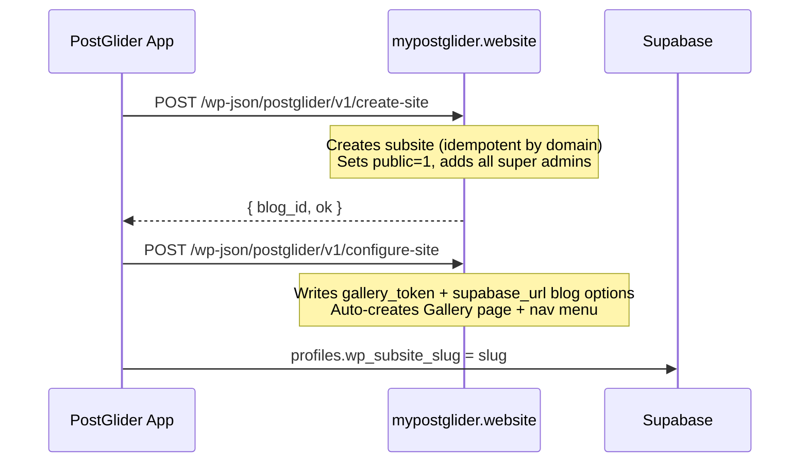
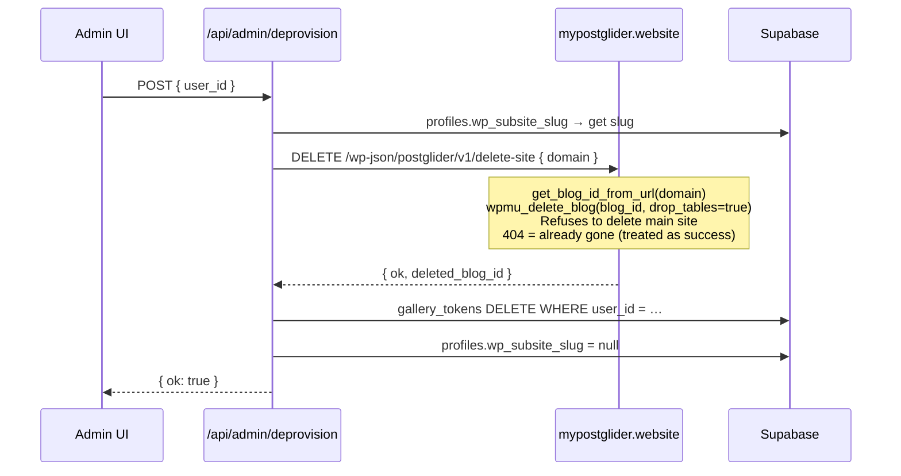

## Overview

| | postglider.com | mypostglider.website |
|---|---|---|
| **Type** | Single site | Multisite |
| **Purpose** | Marketing + billing | SearchIQ / Media Vault per-user subsites |
| **Plugin** | `supawp-pg` (`kenlyle2/supawp-pg`) | `pg-media-vault` (`kenlyle2/pg-media-vault`) |
| **Plugin role** | `supawp/v1/auth/session` session bridge | `postglider/v1/search` per subsite |
| **Subsite creation** | N/A | Auto on first image tag |
| **Credentials set via** | WP Admin → SupaWP Settings | `configure-site` API call |

## postglider.com — Marketing & Billing

Single-site WordPress. The billing platform and subscription manager handle all financial transactions: new subscriptions, upgrades, cancellations, and order history. Users manage billing via the `/my-account` page.

<Callout kind="warning">
  There is no plan to make postglider.com a multisite — ever. All billing stays on this single installation.
</Callout>

The `supawp-pg` plugin is installed here solely to serve the `supawp/v1/auth/session` endpoint that gives PostGlider users a seamless WP session when they click **Manage Subscription** in the app.

WordPress users on postglider.com are created automatically at checkout — every paying subscriber has a WP account.

## mypostglider.website — SearchIQ / Media Vault

WordPress Multisite. Each PostGlider user gets a subsite automatically when their first image is tagged (`provisionWpSubsite()` fires).

The `pg-media-vault` plugin is network-activated here and exposes the `postglider/v1/search` REST endpoint on each subsite. SearchIQ indexes that endpoint to make the user's AI-tagged images semantically searchable inside WordPress.

## Subsite provisioning flow


```mermaid
sequenceDiagram
    participant App as PostGlider App
    participant WP as mypostglider.website
    participant DB as Supabase

    App->>WP: POST /wp-json/postglider/v1/create-site
    Note over WP: Creates subsite (idempotent by domain)<br/>Sets public=1, adds all super admins
    WP-->>App: { blog_id, ok }
    App->>WP: POST /wp-json/postglider/v1/configure-site
    Note over WP: Writes gallery_token + supabase_url blog options<br/>Auto-creates Gallery page + nav menu
    App->>DB: profiles.wp_subsite_slug = slug
```

The `apiguy` Application Password (stored as `WP_API_APP_PASSWORD` in `.env.local`) is used for provisioning — super admin credentials.

<Callout kind="info">
  The App Passwords toggle must be ON in the hosting control panel. Enable it at: **Hosting control panel → Tools → Application Passwords**.
</Callout>

## Subdomain routing — how `*.mypostglider.website` works

Hostinger serves one vhost for the domain with no per-subdomain vhosts and no public API to create them. Subdomains are routed via a **Cloudflare Worker** that rewrites every subdomain request to the main vhost while preserving the original hostname in a header.

### Cloudflare Worker (`pg-subdomain-router`)

Repo: `kenlyle2/pg-subdomain-worker`. Deployed to Cloudflare Workers, bound to `*.mypostglider.website/*`.

1. Receives a request for e.g. `stay-true-tattoo.mypostglider.website/gallery/`
2. Rewrites the URL hostname to `mypostglider.website`
3. Adds `X-Forwarded-Host: stay-true-tattoo.mypostglider.website`
4. Forwards the request; returns the response unchanged

To redeploy after changes:

```bash
cd ~/projects/pg-subdomain-worker
npx wrangler deploy   # CLOUDFLARE_API_TOKEN must be set in ~/.bashrc
```

### `wp-config.php` X-Forwarded-Host fix

The following lines in `wp-config.php` (before `wp-settings.php` is loaded) restore the original subdomain so WordPress loads the correct subsite:

```php
if ( isset( $_SERVER['HTTP_X_FORWARDED_HOST'] ) ) {
    $_SERVER['HTTP_HOST'] = $_SERVER['HTTP_X_FORWARDED_HOST'];
}
```

### Cloudflare SSL configuration

| Scope | Mode | Reason |
|---|---|---|
| `mypostglider.website` (main) | Full (Strict) | Origin has a valid cert |
| `*.mypostglider.website` (subdomains) | Flexible (Configuration Rule) | Hostinger origin cert only covers the apex domain |

Without the Configuration Rule, subdomain requests return a **525 SSL Handshake Failed** error.

### DNS

A single wildcard A record at Cloudflare proxies all subdomains:

```
* A 147.79.72.55  Proxied
```

No per-subdomain DNS entries are needed. New subsites are reachable immediately after `create-site` registers them in `wp_blogs`.

## Gallery page auto-creation

`configure-site` calls `pg_setup_gallery_page()` after writing credentials. This function (idempotent via `_pg_gallery_page` post meta):

1. Creates a published page titled "Gallery" with content `[pg_gallery]`
2. Creates or reuses a nav menu named "Main Menu"
3. Adds the Gallery page as a menu item
4. Assigns the menu to every registered nav location that doesn't already have one

Every newly provisioned subsite has a working gallery at `/gallery/` in the nav immediately — before SearchIQ is configured.

The `[pg_gallery]` shortcode (registered in `gallery.php`) queries `pg_gallery_image` CPT posts, renders a CSS grid from `_pg_image_url` meta, and shows WP tag names as figcaptions.

## Subsite deprovisioning

Use this when a slug needs to be freed for reprovisioning (e.g. business renamed, account cleaned up, or the original provisioning used the wrong slug and you need to start over).

### Admin UI: Subsite Cleanup tab

The deprovisioning tool lives in the PostGlider app at **Admin → Subsite Cleanup** (visible to `is_admin` users only).

<Steps>
  <Step title="Look up the user" icon="search">
    Enter the user's email address and click **Look up**. The panel shows their tier and the active subsite slug, e.g. `stay-true-tattoo.mypostglider.website`.

    If the field reads "No subsite provisioned — nothing to clean up," there is nothing to delete.
  </Step>
  <Step title="Delete the subsite" icon="trash">
    Click **Delete Subsite**. A confirm dialog appears with the full subdomain and a warning that this is irreversible. Click **Yes, delete it**.

    The operation calls `POST /api/admin/deprovision` → `deprovisionWpSubsite()`. On success the panel updates to show "No subsite provisioned."
  </Step>
  <Step title="Reprovision (if needed)" icon="refresh-cw">
    To immediately provision a new subsite for the same user, trigger a new image tag (or call `provisionWpSubsite(userId)` directly). The slug will be re-derived from the current business name.

    If the business name hasn't changed, you may need to update `business_profiles.name` before reprovisioning to get a different slug.
  </Step>
</Steps>

### What deprovisioning does


```mermaid
sequenceDiagram
    participant Admin as Admin UI
    participant API as /api/admin/deprovision
    participant WP as mypostglider.website
    participant DB as Supabase

    Admin->>API: POST { user_id }
    API->>DB: profiles.wp_subsite_slug → get slug
    API->>WP: DELETE /wp-json/postglider/v1/delete-site { domain }
    Note over WP: get_blog_id_from_url(domain)<br/>wpmu_delete_blog(blog_id, drop_tables=true)<br/>Refuses to delete main site<br/>404 = already gone (treated as success)
    WP-->>API: { ok, deleted_blog_id }
    API->>DB: gallery_tokens DELETE WHERE user_id = …
    API->>DB: profiles.wp_subsite_slug = null
    API-->>Admin: { ok: true }
```

Three things happen atomically on the Supabase side after WP confirms deletion:
- `gallery_tokens` row is deleted — the old token can no longer authenticate sync-image calls
- `profiles.wp_subsite_slug` is nulled — future `provisionWpSubsite()` calls will create a fresh subsite
- If the WP delete returns 404 (subsite already gone), the Supabase cleanup still runs — the call is idempotent

<Callout kind="warning">
  `wpmu_delete_blog($id, true)` drops all `wp_{blog_id}_*` tables. Every `pg_gallery_image` stub post, SearchIQ index entry, and blog option is permanently destroyed. There is no undo. Supabase Storage images are **not** affected — they remain in the user's media vault.
</Callout>

### When NOT to deprovision

- **SearchIQ images showing placeholders** — not a subsite problem; see [SearchIQ setup](/admin/searchiq#per-client-searchiq-setup)
- **Slug conflict on a new signup** — `create-site` is idempotent and returns the existing `blog_id` if the domain is already registered. Deprovisioning is only needed if you want to *reassign* a slug to a different user.
- **User wants a fresh gallery** — delete individual `pg_gallery_image` posts, or run a backfill. Don't nuke the subsite.

## Key WordPress credentials

| Credential | Env var | Notes |
|---|---|---|
| `apiguy` Application Password | `WP_API_APP_PASSWORD` | Super admin, used for site provisioning |
| Multisite base URL | `WP_API_BASE_URL` | `https://mypostglider.website` |
