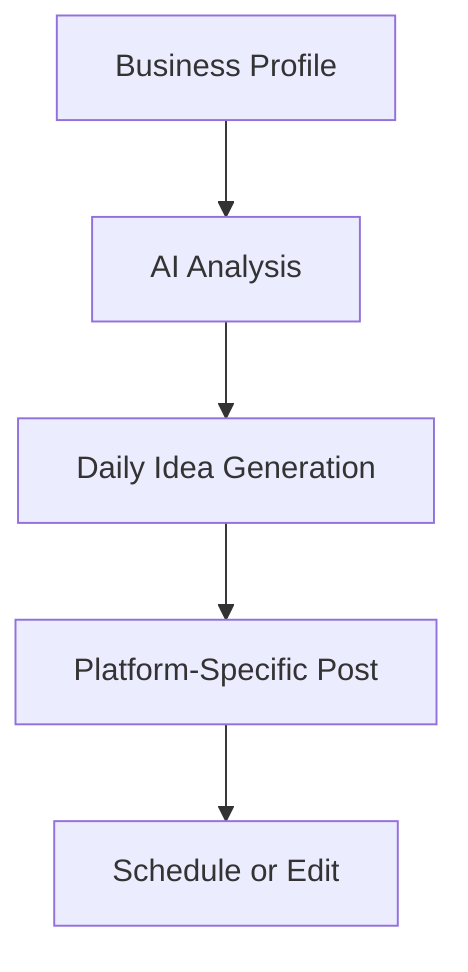

## Overview

PostGlider empowers local businesses with AI-driven tools to streamline social media management. You receive daily post ideas, optimized captions, timing suggestions, and performance insights tailored to your business type. These features work across platforms like Instagram, TikTok, X (formerly Twitter), and Facebook.

<Callout kind="tip">
Start by connecting your social accounts in the dashboard to unlock personalized recommendations.
</Callout>

## Key Features

Explore the core capabilities that make PostGlider essential for consistent social media presence.

<Columns cols={3}>
  <Card title="Daily Post Ideas" icon="zap" href="#daily-post-ideas">
    Get fresh, relevant content ideas every day, customized for your industry.
  </Card>
  <Card title="Caption & Hook Creation" icon="edit-3" href="#caption-creation">
    Generate engaging captions and hooks that boost interaction rates.
  </Card>
  <Card title="Optimal Posting Times" icon="clock" href="#posting-times">
    Receive data-driven suggestions for when your audience is most active.
  </Card>
  <Card title="Business Type Tailoring" icon="target" href="#business-tailoring">
    Content adapts to restaurants, retail, services, and more.
  </Card>
  <Card title="Analytics Insights" icon="bar-chart-3" href="#analytics">
    Track performance and refine your strategy with clear metrics.
  </Card>
</Columns>

## Daily Post Ideas

PostGlider analyzes your business profile and generates one tailored post idea per day per platform.

### How to Access Ideas

<Steps>
  <Step title="Log In" icon="log-in">
    Access your dashboard at `https://dashboard.example.com`.
  </Step>
  <Step title="View Feed" icon="layout">
    Navigate to the "Daily Ideas" section.
  </Step>
  <Step title="Customize" icon="edit">
    Edit the idea or generate variations.
  </Step>
  <Step title="Schedule" icon="calendar">
    One-click schedule to your connected accounts.
  </Step>
</Steps>



## Caption and Hook Creation

Create compelling captions with hooks designed to grab attention. Use the built-in generator for AIDA (Attention, Interest, Desire, Action) structure.

<Tabs>
  <Tab title="Instagram" icon="instagram">
    Generate captions optimized for stories and reels.
    
````jsx
<Request tabs="cURL,JavaScript">
  ```bash
  curl -X POST https://api.example.com/v1/captions \
    -H "Authorization: Bearer YOUR_API_KEY" \
    -d '{"platform": "instagram", "idea": "New coffee blend launch"}'
  ```
  ```javascript
  const response = await fetch('https://api.example.com/v1/captions', {
    method: 'POST',
    headers: { 'Authorization': 'Bearer YOUR_API_KEY' },
    body: JSON.stringify({
      platform: 'instagram',
      idea: 'New coffee blend launch'
    })
  });
  ```
</Request>
````

````json
{
  "caption": "☕ Craving something bold? Our new Midnight Roast hits different! 🔥 Who's ready to fuel their day? DM to order. #CoffeeLovers",
  "hook": "Craving something bold?"
}
````
  </Tab>
  <Tab title="TikTok" icon="video">
    Short, trendy hooks for viral videos.
    
    <Callout kind="success">
      TikTok captions include trending hashtags automatically.
    </Callout>
  </Tab>
</Tabs>

## Optimal Posting Times

PostGlider suggests times based on your audience data and platform algorithms.

| Platform   | Peak Times (Local) | Engagement Boost |
|------------|--------------------|------------------|
| Instagram | 8-10 AM, 7-9 PM   | +25%            |
| TikTok    | 6-10 PM           | +40%            |
| X         | 9 AM - 12 PM      | +15%            |
| Facebook  | 1-3 PM            | +20%            |

<Expandable title="How Suggestions Work" default-open="true">
  AI reviews past performance and global benchmarks to recommend slots. Override manually if needed.
</Expandable>

## Content Tailoring for Business Types

Select your business type during setup—PostGlider adapts content accordingly.

<Tabs>
  <Tab title="Restaurant" icon="utensils">
    Ideas focus on menus, specials, and events.
  </Tab>
  <Tab title="Retail" icon="shopping-bag">
    Product spotlights and promotions.
  </Tab>
  <Tab title="Services" icon="tool">
    Testimonials and tips.
  </Tab>
</Tabs>

## Analytics and Performance Insights

Monitor post performance with intuitive dashboards.

<ResponseField name="engagement_rate" field-type="number" required="true">
  Percentage of interactions per impression.
</ResponseField>

<ResponseField name="top_posts" field-type="array">
  Array of best-performing content.
</ResponseField>

<CodeGroup tabs="Dashboard API">
````javascript
// Fetch analytics
const analytics = await fetch('https://api.example.com/v1/analytics?period=30d', {
  headers: { 'Authorization': 'Bearer YOUR_API_KEY' }
}).then(res => res.json());
````
````python
import requests
response = requests.get(
    'https://api.example.com/v1/analytics?period=30d',
    headers={'Authorization': 'Bearer YOUR_API_KEY'}
)
````
</CodeGroup>

## Next Steps

<Columns cols={2}>
  <Card title="Quickstart" icon="rocket" href="/quickstart">
    Set up in minutes.
  </Card>
  <Card title="Authentication" icon="shield" href="/authentication">
    Secure your API access.
  </Card>
</Columns>

<Callout kind="info">
  Integrate via API for automated workflows. Check the dashboard for real-time updates.
</Callout>