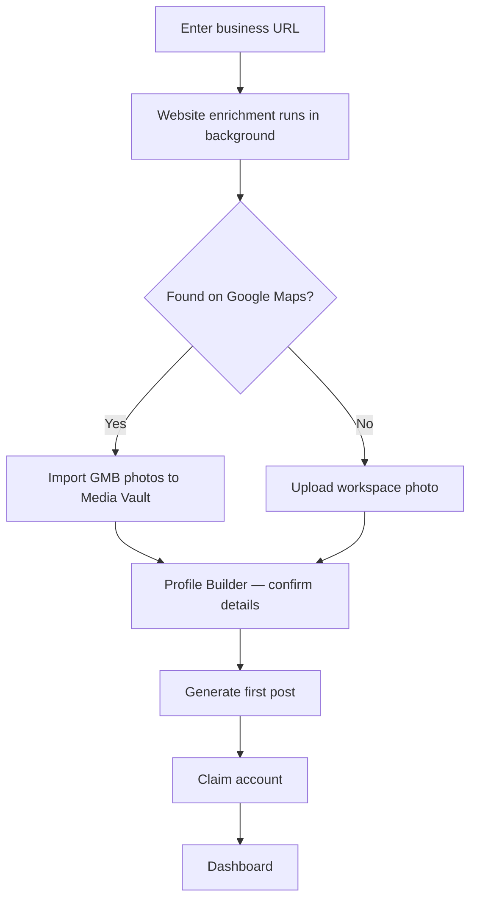

## Overview

The `/start` onboarding flow is designed so that a new user never touches a form from scratch. PostGlider does the research first, then shows you the results to confirm. The entire flow takes about five minutes.

## Step 1 — Website Enrichment

You provide your business website URL. PostGlider immediately runs an enrichment lookup in the background to auto-populate:

- Business name and location
- Industry category
- Services offered
- Peak hours and busy days
- Real Google review themes

While enrichment runs, you continue through the flow. By the time you reach the business form, the fields are already filled in.

<Callout kind="info">
  If enrichment is still running when you reach the business form, you'll see a brief "Analyzing your site…" animation. Fields fill in as soon as results arrive.
</Callout>

## Step 2 — Google Business Profile

PostGlider searches Google for your GMB listing. One of two things happens:

<Tabs>
  <Tab title="Business found" icon="check-circle">
    PostGlider shows a confirmation card with your business photo, name, and address. Click **Yes, that's me** to confirm.

    On confirmation:
    - Your GMB photos are scored by AI on marketing quality (lighting, subject clarity, brand fit — scale of 1–10)
    - Photos scoring above the threshold are imported directly into your **Media Vault**, pre-tagged with their GMB labels

    This is the fastest way to populate your vault — you may arrive at the Dashboard with 10–20 tagged, scored images already waiting.
  </Tab>
  <Tab title="Business not found" icon="alert-circle">
    No GMB listing was found. This is common for new businesses, service-area businesses, or businesses with an inconsistent name on Google.

    You'll be prompted to upload a photo of your workspace or team. This photo is used for the first generated image and stored in your Media Vault.

    <Callout kind="tip">
      You can connect your Google Business Profile later from **Settings → Google Business**. GMB import is always available from the Media Vault.
    </Callout>
  </Tab>
</Tabs>

## Step 3 — Profile Builder

PostGlider shows three profile cards to confirm or refine your business details:

1. **Business basics** — name, location, industry (pre-filled from enrichment)
2. **Your offer** — services, differentiator, target audience
3. **Brand voice** — tone (Friendly, Professional, Bold, Casual) and any style notes

Each card takes about 30 seconds. These details drive every piece of content PostGlider generates — the more accurate they are, the better the output.

## Step 4 — First Post Generated

Before you've created an account, PostGlider generates your first complete post:

- **One AI-written post concept** — a specific angle based on your profile
- **One caption** — platform-ready with a call to action
- **One photorealistic image** — AI-generated to match your brand and post concept

You can regenerate as many times as you like before claiming.

<Callout kind="info">
  Image generation during onboarding uses 3–5 credits from your free tier allocation — no payment required.
</Callout>

## Step 5 — Account Creation

When you're happy with a result, click **Claim This Idea**. Enter your email and password.

When you submit:
- Your anonymous session is upgraded to a permanent account
- Your profile, first idea, and generated images are all preserved
- You land on the **Dashboard** ready to generate more

<Callout kind="tip">
  You can share the result before claiming — PostGlider generates a shareable preview link. Useful for showing a client what's possible before they commit.
</Callout>
